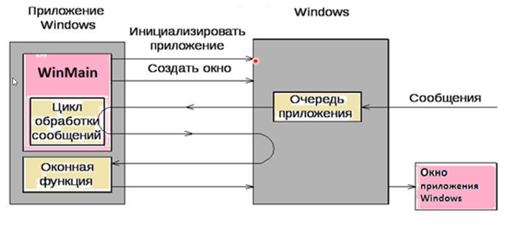
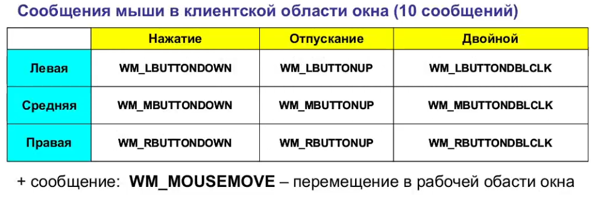
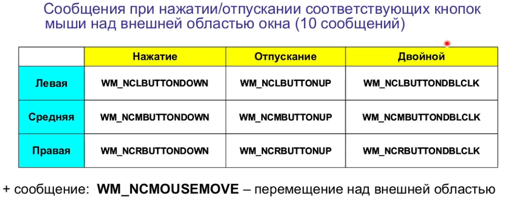
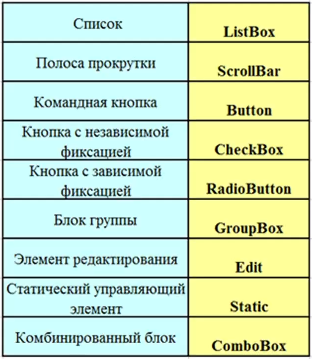
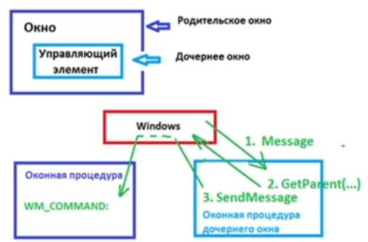
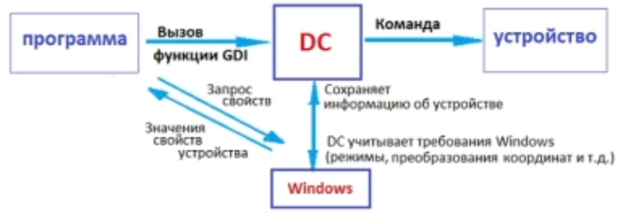

## Системное программное обеспечение, функции ОС, взаимодействие программ на языках С++ и С#  с операционной системой.

**Системное ПО** - программы для взаимодействия с системным, техническим, аппаратным обеспечением, что подразумевает сильную зависимость таких программ от рабочей среды и аппаратной платформы.

**Функции ОС:**

	1. Файловая система - организация работы с памятью, иерархическая структура
	2. Система управления памятью - выделение ОЗУ, обращение к фрагментам памяти
	3. Система управления программами - ряд функций, которые управляют программами
	4. Связь с драйверами устройств (обслуживающими программами)
	5. Обработка ошибок -
	6. Служба времени - (позволяет синхронизировать все операции компьютера)
	7. Служба ввода/вывода консоли оператора (клавиатура и монитор)

**Взаимодействие программ на языках С++ и С# с операционной системой.**

Все взамодействие происходит через механизм сообщений.

## Шаблон программы под Windows (создание приложения, назначение программы WinMain, класс окна, оконная процедура).

**Cоздание приложения**

В Visual Studio есть шаблон стандартного приложения Windows. Там содержится базовый код, характерный для любого приложения.

**Назначение программы WinMain** - точка входа в программу Windows. Может отличаться у производителей ПО для написания программ (Borland, Microsoft), но потом преобразуется к WinMain.

В Win32 имеет следующий вид:
```cpp
// Точка входа в приложение
int APIENTRY wWinMain(_In_ HINSTANCE hInstance,			// Дескриптор экземпляра приложения
					 _In_opt_ HINSTANCE hPrevInstance,	// Дескриптор предыдущего экземпляра приложения
					 _In_ LPWSTR	lpCmdLine,			// Передача командной строки (??) указатель на командную строку, если приложение так запущено
					 _In_ int		nCmdShow)			// Установки для окна (нормальное, на весь экран и тп + CLI?)
```

**Класс окна**
Есть некоторая структура данных, в которой можно заполниоть поля и передать ОС (запись в таблице ОС, где записаны основные св-ва окна данного типа)

**Оконная процедура**
Оконная процедура - функция обработки сообщений. Может иметь любое имя (обычно WndProc) и вызывается операционной системой.

```cpp
LRESULT CALLBACK WndProc(HWND hWnd, UINT msg, WPARAM wParam, LPARAM lParam);
```
Параметры: дескриптор окна `HWND`, код сообщения `msg`, и два параметра.
Оконная процедура обрабатывает только необходимые (запланированные программистом
) сообщения, а все остальные обрабатывает оконная процедура по умолчанию (`DefWindowProc`). Весь код, который относится к данному окну, должен быть вставлен в оконную процедуру.

## Основные возможности системного программирования в среде Builder C++. Компоненты вкладки System. Работа с сообщениями.

**Основные возможности:**
- Создание форм.
- Форма-проект окна приложения и его на экране рисует сам Borland или ОС по его просьбе
- Форма нужна для проектирования приложения
- Главная функция WinMain находится в Project.cpp
- Создает шаблон программы, в которм есть инициалицация, создание окон и запуск цикла обработки сообщений.
- Можно вызывать функции Windows, так как в классах элементов, являющимися системными объектами, есть поля для дескрипторов этих элементов (например, у Button и Edit есть такое поле, а у Label нет) и их можно передать как параметры в функции Windows (например, `::SetParent(childHandle, parentHandle) `).
- Имеется возможность обрабатывать нажатия на несистемные объекты. Так, можно обработать нажатие на элемент Label (Borland), тогда как элемент Static (Win32) не принимает сообщения и служит только для вывода информации. Обработка таких нажатий производится через координаты места, в которое нажали.

**Компоненты вкладки System.**
- Таймер - логическое время. Будет слать программе сообщения равномерно.
- PaintBox - прямоугольник, на котором можно рисовать.
- MediaPlayer
- OLE - интеграция программных приложений.

## Главная программа приложения Windows. Основные функции. Цикл обработки сообщений.

**Главная программа:**

1. Создает и регистрирует класс окна (`MyRegisterClass()`)
2. Создает окно (в `InitInstance()`) - т.е. добавляет в таблицу ОС новую строку.
3. Выводит окно на экран (`ShowWindow()`)
4. Запускает цикл обработки сообщений

В Win32 имеет следующий вид:
```cpp
// Точка входа в приложение
int APIENTRY wWinMain(_In_ HINSTANCE hInstance,			// Дескриптор экземпляра приложения
					 _In_opt_ HINSTANCE hPrevInstance,	// Дескриптор предыдущего экземпляра приложения
					 _In_ LPWSTR	lpCmdLine,			// Передача командной строки (??) указатель на командную строку, если приложение так запущено
					 _In_ int		nCmdShow)			// Установки для окна (нормальное, на весь экран и тп + CLI?)
```

В `WinMain` вызываются следующие функции:
```cpp
// регистрация класса окна (стили, точка входа в оконную процедуру (WndProc), дескриптор экземпляра приложения, иконки, курсоры, меню)
ATOM MyRegisterClass(HINSTANCE hInstance){}
```

```cpp
// инициализация приложения (создание основного окна, дочерних окон, показ окна, обновление окна)
BOOL InitInstance(HINSTANCE hInstance, int nCmdShow){}
```

И запускается цикл обработки сообщений:
```cpp
MSG msg;

// Цикл основного сообщения:
while (GetMessage(&msg, nullptr, 0, 0))
{
	if (!TranslateAccelerator(msg.hwnd, hAccelTable, &msg))
	{
		TranslateMessage(&msg); // перевод сообщений клавиш в символьные сообщения
		DispatchMessage(&msg);	// распределение сообщений по оконным процедурам
	}
}
```


## Организация многозадочности в Windows.

**Многозадачность (multitasking)** - свойство операционной системы или среды программирования обеспечивать возможность параллельной (или псевдопараллельной) обработки нескольких процессов.

Виды организации многозадачного режима работы:
- совместная или кооперативная многозадачность (следующая задача выполняется только после того, как текущая вернула управление)
- вытесняющая или приоритетная многозадачность (ОС сама передает управление от одной одной выполняемой программы другой)

В Windows - приоритетная многозадачность.

Переключение возникает
- без всякого пожелания самой программы и буквально между любыми двумя операторами;
- распределение процессорного времени осуществляется планировщиком процессов;
- задаче может быть назначен (пользователем или ОС определенный приоритет, что обеспечивает гибкое управление распределением процессорного времени;
- обеспечивает более быстрый отклик на действия пользователя;
- повышение надежности системы (идеал: «ни одна программа пользовательского режима не может нарушить работу ОС в целом»);
- возможность многозадачного ввода-вывода в ядре ОС, когда ожидание завершения ввода-вывода одной программой позволяет процессору тем временем исполнять другую программу.

Особенности развитых многозадачных систем
-  Каждая задача имеет свой приоритет, в соответствии с которым получает процессорное время и память
- Система организует очереди задач так, чтобы все задачи получили ресурсы, в зависимости от приоритетов и стратегии системы
- Система организует обработку прерываний, по которым задачи могут активироваться, деактивироваться и удаляться
- По окончании положенного кванта времени ядро временно переводит задачу из состояния выполнения в состоячие готовности, отдавая ресурсы другим задачам.
- Система обеспечивает защиту адресного пространства задачи от несанкционированного вмешательства других задач (а также защиту адресного пространства своего ядра)
- Система распознаёт сбои и зависания отдельных задач
- Система решает конфликты доступа к ресурсам и устройствам
- Система гарантирует каждой задаче, что рано или поздно она будет
активирована
- Система обеспечивает коммуникацию между процессами

**Планировщик процессов** - компонент операционной системы, который планирует запуск задач - потоков (в определённое время, через заданные интервалы, при возникновении соответствующих событий.

**Квант** - это интервал процессорного времени, отведенный потоку для выполнения. По окончании кванта Windows проверяет, ожидает ли выполнения другой поток с таким же уровнем приоритета. Если на момент истечения кванта других потоков с тем же уровнем приоритета нет, планировщик выделяет текущему потоку еще один квант.

## Операционные системы: прерывания, механизм обработки прерывания, типы прерываний.

**Прерывания** - механизм, позволяющий согласовывать параллельную работу отдельных устройств вычислительной системы и реагировать на особые состояния, возникающие при работе процессора.

Механизм обработки прерываний:
1. Запоминание состояния прерванного процесса (регистры процессора)
2. Управление аппаратно передается программе обработки прерывания
3. Обработка прерывания
4. Восстановление информации прерванного процесса
5. Возврат в прерванную программу

- Переход от прерываемой программы к обработчику и обратно должен выполняться как можно быстрей;
- Одним из быстрых методов является использование таблицы, содержащей перечень всех допустимых прерываний и адреса соответствующих обработчиков;
- Все прерывания имеют собственные номера и точки входов (в обработчик прерывания).

**Типы прерываний:**
1. *Аппаратное:* событие генерируемое внешним по отношению к процессору устройству (клавиатура, таймер и т.д.)
2. *Программное* возникает в результате выполнения программойкоманды INT. Фактически это вызов функций ядра ОС, т.е. системые вызовы. Вызов функции WinAPI приводит к программному прерыванию.
3. *Исключительная ситуация:* событие, возникающее в результате выполнения программой недопустимой команды.

## Структура приложения Windows, порядок создания приложения. Ресурсы доступные для использования в приложении.
Прикладная программа все время должна взаимодействовать с ОС. Приложение под Windows зависит от нее полностью и не может быть запущена под другой ОС.



Только Windows вызвает оконную процедуру, которая в соответствии с сообщением возвращает управление Windows в любом случае (если нужно что-то нарисовать, обработать сообщение по умолчанию и т.п.). И уже Windows будет что-то выводить в окно приложения. То есть сама программа как бы ничего не делает и все время общается с ОС, поэтому "оторвать" приложение от ОС нельзя.

**Создание приложения**

Файлы с исходным кодом на языке программироания и заголовочные файлы компилируются в объектные файлы (`.obj`). Также файлы описания ресурсов, написанные на специальном языке описания ресурсов, и сами ресурсы (акселераторы, диалоговые окна, битовые карты, иконки, курсоры, таблицы строк) также компилируются в бинарные файлы с расширением `.res`. Далее объектные файлы и бинарные файлы ресурсов, а также стандартные библиотеки и библиотека Windows собираются в исполняемый файл `.exe` (линковка, редактирование связи).

Использование ресурсов позволяет создавать гибкие приложения, например можно делать разные языки (нужный ресурс загружается в любой момент времени).

## Объекты операционной системы, использование дескрипторов. Окна – основные объекты ОС, виды окон и их элементы.

**Примеры объектов ОС**:
1. Окна
2. Управляющие элементы
3. Меню
4. Контексты устройств и инструменты для рисования
5. Пиктограммы
6. Курсоры и т.д.

**Дескрипторы**

Каждый объект в системе имеет свой уникальный описатель (*дескриптор*, handle). Дескриптор можно рассматривать, как индекс (номер) объекта в некоторой системной таблице объектов.

Использование дескрипторов позволяет:
- упростить работу программиста, скрыв от него детали внутренней организации системы;
- модифицировать и совершенствовать работу системы, не изменяя код прикладных программ;
- сделать программное обеспечение максимально независимым от аппаратного обеспечения.

**Окна**

Каждая программа создает окно.
Программа может иметь и несколько окон, но одно из них обязательно является главным.

С точки зрения программы: окно это системный объект, и она может управлять им (создавать, перемещать, уничтожать и т.д.) с помощью специальных функций из WinAPI.

Окна, использующиеся в Windows:
- Окно рабочего стола (desktop window) создается автоматически при запуске Windows, это определяемое системой окно, которое отображает фон экрана (для этого используется рисунок bitmap) и служит основой для всех остальных окон.
- Главное окно должно быть у каждого графического приложения. Главное окно определяет интерфейс с пользователем. Главное окно отвечает за все приложение целиком.

Приложения могут также создавать другие окна, каждое из которых может участвовать в отображении выходных даных и получении входных данных от пользователя.

Компоненты окна:
- заголовок (title bar) отображает заданный приложением значок и строку текста (определяются при создании окна). *Обеспечивает перемещение.*
- меню (menu bar) - список команд, поддерживаемых приложением. Пункты меню являются основными категориями команд. Выбор команды пользователем кодируется системой в виде сообщения.
- системное меню (system menu) создается и управляется Windows (содержит стандартный набор пунктов).
- клиентскую область (client area) - это часть окна, в которой приложение отображает выходные данные такие, как текст или графику. Информация, выводимая в данную область, определяется в оконной процедуре.
- кнопка минимизации (minimize button)
- кнопка максимизации (maximize button)
- кнопка восстановления (restore button)
- кнопка закрытия приложения (close button)
- рамка, позволяющая менять размеры окна (sizing border)
- горизонтальную и вертикальную полосы прокрутки (horizontal and vertica scroll bars).

Система управляет большей частью поведения неклиентской области; а приложение отвечает за вид и поведение клиентской области.

Окна программного приложения:
- Управляющие элементы (control)
- Диалоговое окно (dialog box)
- Окно сообщений (message box)

**_Главное окно_** определяет интерфейс с пользователем и отвечает за все приложение целиком.

**_Вспомогательные окна_** используются для отображения какой-либо информации на короткое время.

**_Дочерние окна_** визуально находятся на области родителького и никогда не бывают активными (пользователь не может работать с одной кнопкой, например).

Управляющие элементы пользовательского интерфейса (control) - это тоже окна (дочерние, то есть расположенные в окне родителя). Они используются для получения информации от пользователя, например, будучи размещенными в диалоговом окне могут обслуживать некоторую задачу. \
Диалоговое окно (dialog box) - это окно, которое содержит один или более управляющих элементов и обладает специальными свойствами. \
Окно сообщений (message box) - это окно, которое отображает некоторую информацию, например, предупреждение для пользователя (создается особым образом).

## Оконный класс, стили окна, регистрация оконного класса. Создание окна.

**Оконный класс** - класс, на основе которого создаются окна (на базе одного класса можно создать несколько окон).
Windows предоставляет предопределенные классы (кнопки, списки, флажки и т.п.), но также можно создавать окна на основе своего класса, после его регистрации (`RegisterClass()`). Свойства класса представляются в специальной структуре `WNDCLASS`.

Регистрация класса:
```cpp
WNDCLASS wndclass;
// Здесь необходимо заполнить структуру WNDCLASS
RegisterClass(&wndclass);
// RegisterClassExW();
```

`RegisterClass` производит регистрацию оконного класса и возвращает целочисленное значение(*`handle`*, идентифицирующий оконный класс в системе).

```cpp
typedef struct tagWNDCLASS {
	UINT style; 		  // флаги, задающие начальные свойства всех окон, создаваемых на основе данного класса
	WNDPROC IpfnWndProc;  // указатель на CALLBACK функцию (оконную процедуру)
	int cbClsExtra;
	int cbWndExtra;
	HINSTANCE hinstance;  // дескриптор экземпляра приложения
	HICON hicon; 		 // дескриптор пиктограммы
	HCURSOR hCursor; 	 // дескриптор курсора окна
	HBRUSH hbrBackground; // дескриптор кисти для закраски фона окна
	LPCSTR IpszMenuName;  // идентификатор меню
	LPCSTR IpszClassName; // идентификато класса
} WNDCLASS;
```

Стили окна:
- `CS_DBLCLKS` - посылать сообщение от мыши при двойном щелчке в пределах класса окна;
- `CS_HREDRAW` - перерисовывать окно при изменении ширины (если изображение не зависит от ширины окна, то данный стиль можно не устанавливать);
- `CS_NOCLOSE` - отключить команду «Закрыть» (в системном меню);
- `CS_VREDRAW` - перерисовывать окно при изменении вертикальных размеров (если изображение не зависит от высоты окна, то данный стиль можно не устанавливать).

При регистрации оконного класса программа должна узнать, имеется ли в памяти ее копия или это первый экземпляр программы (регистрировать класс нужно только один раз). Каждый экземпляр идентифицируется своим дескриптором и при запуске нового экземпляра программы ему передается дескриптор уже существующего экземпляра (предыдущего). Для первого экземпляра программы `PrevInst = 0`.

**Создание окна**

Для создания окна используется функция `CreateWindow`, которая возвращает дескриптор (*`handle`* вновь созданного окна, иначе `NULL`), который используется затем для отображения и обновления окна.
После выполнения функции `CreateWindow` окно формируется в памяти, но не отображается на экране.
При создании можно также указать (или изменить) некоторые свойства окна: заголовок, стиль, расположение и т.д.

```cpp
HWND CreateWindow(
    LPCTSTR lpClassName,   // указатель на зарегистрированное имя класса
    LPCTSTR lpWindowName,  // указатель на имя окна
    DWORD dwStyle,         // стиль окна
    int x,                 // горизонтальная позиция окна
    int y,                 // вертикальная позиция окна
    int nWidth,            // ширина окна
    int nHeight,           // высота окна
    HWND hWndParent,       // дескриптор родительского или окна владельца
    HMENU hMenu,           // дескриптор меню или ID дочернего окна
    HANDLE hInstance,      // дескриптор экземпляра приложения
    LPVOID lpParam         // указатель на данные создания окна
);
```

После создания окно необходимо отобразить на экране, для этого используется функция `ShowWindow`:
```cpp
BOOL ShowWindow(
    HWND hWnd,    // дескриптор окна
    int nCmdShow  // состояние показа окна (вид окна при отображении)
);
```
Функция возвращает `true`, если до вызова окно уже было визуализировано,
в противном случае - `false`.

Вид окна при отображении:
- `SW_HIDE` - окно исчезает и теряет активность;
- `SW_SHOWNORMAL` - окно становится активным и отображается на экране (координаты и размеры восстанавливаются);
- `SW_SHOWMINIMIZED` - окно становится активным и отображается в виде пиктограммы;
- `SW_SHOWMAXIMIZED` - окно становится активным и отображается максимально открытым;
- `SW_SHOWNOACTIVATE` - окно отображается с текущими положені м и размерами (активное окно остается активным);
- `SW_SHOW` - окно становится активным и отображается с текущими положением и размерами;
- `SW_MINIMIZE` - окно минимизируется (активность переходит к предыдущему активному окну);
- `SW_SHOWNA` - окно отображается в текущем состоянии (активное в данный момент окно остается активным);
- `SW_RESTORE` - окно остается активным и отображается на экране (если было минимизировано или максимизировано, то координаты и размеры восстанавливаются).

## Механизм обработки сообщений. Структура сообщения, цикл обработки сообщений, источники сообщений.

**Обработка сообщений**

Возникающие события помещаются в системную очередь сообщений (30 сообщений). Для каждого приложения Windows организует отдельную очередь сообщений (по умолчанию до восьми сообщений). Из системной очереди сообщения распределяются по очередям приложений: Windows извлекает очередное сообщение из системной очереди, определяет, к какому окну оно относится, и помещает в очередь соответствующего приложения.

В каждый момент времени одновременно может выполняться несколько приложений с множеством окон, однако только одно из них может иметь фокус ввода (то есть получать сообщения от клавиатуры). Приложение, окно  которого имеет фокус ввода, называется активным (таким образом, все сообщения от клавиатуры помещаются в очередь активного приложения).

Приложение само обрабатывает свою очередь сообщений, организуя для этого цикл обработки сообщений. В цикле осуществляется выбор нового сообщения из очереди и вызов диспетчера для его обработки соответствующей функцией (называемой оконной процедурой, так как все сообщения связаны с окнами).

**Структура сообщения**

**Сообщение** - это структура, в полях которой информация о произошедшем событии:

```cpp
typedef struct tagMSG{
	HWND hwnd; 	// дискриптор окна, которому предназначено сообщение
	UINT message;  // код сообщения
	WPARAM wParam; // дополнительные параметры
	LPARAM IParam; // дополнительные параметры
	DWORD time;	// время посылки сообщения
	POINT pt;  	// положение курсора мыши
} MSG;
```

- `wParam, IParam` сожержат дополнительную информацию и зависят от типа сообщения, в собственных сообщениях пользователя могут использоваться для передачи любой необходимой информации;
- `time` содержит время в миллисекундах, которое истекло с момента запуска системы до постановки его в очередь;
- `pt` содержит позицию курсора мыши в экранных координатах на момент возникновения события.

**Цикл обработки сообщений**

- получение события;
- диспетчеризация сообщения (выбор нужной подпрограммы обработки события) соответствующей процедуре обработки;
- проверка условия выхода из программы.

Событие - это любое произошедшее действие, от которого может зависеть ход выполнения программы, например, создание окна, нажатие клавиши на клавиатуре, щелчок, двойной щелчок мыши или ее перемещение и т.д. Все произошедшие события фиксируются системой и представляются в виде сообщений.

**Источники сообщений**
- интерфейс пользователя (нажатие клавиш, кнопок мыши, выбор пункта меню или работа с управляющими элементами и т.д.);
- операционная система посылает сообщения программе уведомления о тех или иных событиях;
- вызов программой функций WinAPI может привести к посылке сообщений программе (например, функция `UpdateWindow()` шлет сообщение `WM_PAINT`);
- прикладная программа может посылать сообщение самой себе или другим программам;
- возникновение некоторых событий может приводить к новым сообщениям (например, два щелчка подряд кнопкой мыши с небольшим интервалом расцениваются системой как двойной щелчок).

## Программирование, управляемое событиями. Основные особенности. Порядок взаимодействия программы и операционной системы.

- Сообщения могут передаваться оконной процедуре немедленно, а могут помещаться в очередь сообщений.
- Программист должен придерживаться новой концепции разработки - программа разбита на фрагменты (обработчики событий).
- Приложение выполняет некоторые фрагменты кода только в ответ на полученные сообщения.
- Процедура окна получает множество различных сообщений, но обрабатывать может только то, что непосредственно влияет на решаемые задачи.
- Основной поток сообщений генерирует интерфейс пользователя (пользователь управляет работой приложения).
- Приложение может развиваться постепенно (в каждый момент времени можно иметь работающий вариант программы, снижаются риски - увеличивается надежность работы).
- Система предоставляет в распоряжение программиста стандартный шаблон приложения (увеличивается эффективность труда разработчиков).

Операционная система организует очередь приложения. Для каждого приложения сообщения из системной очереди отправляются в очередь конкретного приложения. Когда происходит какое-то событие, Windows фиксирует его в виде сообщения (структуры `MSG`), ставит в системную очередь и затем это сообщение переходит в очередь приложения, которому оно было направлено. В приложении запущен цикл обработки сообщений и в нем получается сообщение от системы (функция `GetMessage()`), далее в этом цикле происходит небольшая обработка (перевод сообщений клавиш в символьные сообщения) и далее это сообщение опять поступает в ОС (функция `DispatchMessage()`), для того, чтобы та вызвала соответствующую оконную процедуру. Оконная процедура в конце концов возвращает управление обратно системе (например, оконная процедура может попросить систему изобразить что-то в окне приложения).

События, определяемые операционной системой:
1. Windows кодирует все события в виде сообщений.
2. Источником сообщений может быть не только система, но и сама программа или другое приложение.
3. Для генерации сообщений из программы и передачи их соответствующей оконной функции можно использовать различные функции: `SendMessage()`, `PostMessage()`

События, определяемые инструментарием программиста:
1. имеют свои имена (часто с «On»: `OnClose`, `OnClick`, `OnCreate`);
2. могут не соответствовать событиям и сообщениям Windows;
3. вообще не являются ни событиями, ни сообщениями (определяются на уровне классов окон библиотек, предоставляемых в распоряжение программистов).


## Сообщения с точки зрения операционной системы, программного приложения и пользователя программного обеспечения.

С точки зрения операционной системы  - структура данных, в полях которой информация о произошедшем событии.
Приложение тоже имеет дело со структурой.

Сообщения, с точки зрения пользователя - реакция на то, что он делает.

## Сообщения. Принципы обработки. Сообщения мыши.

**Классификация сообщений**

По функциональным признакам:
- Системные
- Управление окнами
- От мыши
- Клавиатуры
- Таймера и т.д.

По уровням обработки:
- Старшие (порождают другие)
- Относящиеся к одному событию
- Младшие

По источникам сообщений:
- Интерфейс пользователя
- Аппаратура
- Система Windows
- Программные приложения
- Другие сообщения.

Сообщения по смыслу
- Начало работы с окном: `WM_CREATE`, `WM_ACTIVATE`, `WM_PAINT` …
- Команды меню и управляющие элементы: `WM_COMMAND` (с идентификатором);
- Сообщения мыши (количество: 21)
- Сообщение клавиатуры: `WM_CHAR` (ввод символов)
- Сообщение таймера: `WM_TIMER` (организация выполнения действий с равными временными интервалами).
- Сообщения от внешних устройств.

**Получение сообщения:**
```cpp
BOOL PeekMessage(
	LPMSG lpMsg,		// Указатель на структуру MSG
	HWND hWnd,		// Указатель на окно (кому сообщение)
	UINT wMsgFilterMin,	// для маски минимум
	UINT wMsgFilterMax,	// для маски максимум
	INT wRemoveMsg		// Что делать с сообщением (оствить в очереди, удалить из очереди, предотвратить передачу управления другим задачам)
);
```

```cpp
BOOL GetMessage(
	LPMSG lpMsg, // указатель на структуру
	HWND hWnd, // указатель окна чьи сообщения нужно обрабатывать
	UINT wMsgFilterMin, // номер мимимального сообщения для выборки
	UINT wMsgFilterMax // номер максимального сообщения для выборки
	// всегда удаляет сообщение из очереди
);
```
Цикл обработки сообщения дополнительно обрабатывает сообщение от клавиатуры (`TranslateMessage()`) и сообщение перенаправляется системе для вызова оконной функции.

**Посылка сообщений**

Источником сообщений может быть не только система, но и сама программа или другое приложение. Для генерации сообщений из программы и передачи их соответствующей оконной функции можно использовать различные функции: `SendMessage`, `PostMessage`, `PostQuitMessage`.
Функция `PostMessage` помещает сообщение в очередь прикладной программы и, не дожидаясь его обработки, возвращает управление в точку вызова (в случае успешной постановки сообщения функция возвращает `true`):
```cpp
BOOL PostMessage(
    HWND hWnd,
    UINT Msg,
    WPARAM wParam,
    LPARAM lParam
);
```
Переданное собщение будет обработано только после очередного обращения к `GetMessage` (`PeekMessage`). Таким образом, осуществляется асинхронная обработка сообщений.

Для организации немедленной обработки сообщений следует использовать функцию `SendMessage`, которая сразу вызвает оконную процедуру и не возвращает управление до тех пор, пока сообщение не будет обработано.

```cpp
BOOL SendMessage(
    HWND hWnd,
    UINT Msg,
    WPARAM wParam,
    LPARAM lParam
);
```

**Сообщения мыши**

Окно получает сообщения от мыши, когда ее курсор находится над этим окном.
Сообщения посылаются либо окну захватившему мышь, либо окну под курсором.
Сообщения разделяются по действию пользователя (щелчок или двойной щелчок) и используемой кнопке мыши.

_также см. следующий пункт_

## Особенности работы с мышью, работа с рабочей и нерабочей областью окна. Программное управление курсором.

**Сообщения мыши в клиентской области**



Двойной щелчок - младшее сообщение, по отношению к двум другим.

Параметры - координаты отностиельно левого верхнего угла клиентской области окна.

Параметр `lParam` содержит координаты курсора (х - младшее, у - старшее слово) относительно клиентской области:
```cpp
LOWORD(lParam) // получить младшее слово
HIWORD(lParam) // получить старшее слово
```
Параметр `wParam` содержит комбинацию флагов (`MK_CONTROL`, `MK_SHIFT`, `MK_LBUTTON`, `MK_RBUTTON`).

Сообщение `WM_MOUSEMOVE` посылается в окно тогда, когда курсор перемещается в рабочей области окна (`WM_NCHITTEST` возвратило `HTCLIENT`).
Количество таких сообщений зависит аппаратного обеспечения и скорости обработки сообщений приложением.

**Сообщения мыши нерабочей области**



_**NC**_ в названии сообщения говорит о том, что нажатия вне клиентской области.

Параметры - координаты отностиельно экрана.

Параметр `lParam` содержит координаты курсора (х - младшее, у - старшее слово) относительно рабочего стола

Параметр `wParam` содержит константу, определяющую участок нерабочей области:
- `HTCAPTION` - заголовок
- `HTMENU` - меню
- `HTBOTTOM` - нижняя сторона рамки
- `HTTOP` - верхняя рамка
- `HTTOPLEFT` - левый верхний угол
- `HTZOOM` - кнопки «min / max»

Преобразование координат:
```cpp
ScreenToClient(hWnd, lpPoint);
ClientToScreen(hWnd, lpPoint);
```

`WM_NCHITTEST` - старшее сообщение мыши (предшествует любым сообщениям мыши). Передается окну при перемещения мыши через область окна, параметры координаты курсора мыши относительно рабочего стола.
Обычно сообщение передается на обработку в процедуру `DefWindowProc` (т.е. обрабатывается операционной системой).
После обработки сообщения возвращается одно из значений, которое характеризует местоположение курсора мыши (например, `HTCLIENT` - курсор находится над внутренней областью окна, `HTTOPLEFT` - над верхним левым уголком рамки окна и т.д.).

**Программное управление курсором**

1. Загрузка курсора. В системе существуют различные предопределенные курсоры, которые можно загрузить:
```cpp
HCURSOR LoadCursor (NULL, <идентификатор курсора>)
```
Идентификаторы: `IDC_ARROW` - стандартная стрелка, `IDC_CROSS` - перекрестие, `IDC_WAIT` - песочные часы и т.д.
2. Показать/ спрятать курсор (в пределах окна приложения):
```cpp
ShowCursor (true / false);
```
3. Установить текущую позицию курсора:
```cpp
POINT pt;
SetCursorPos(x,y);
```
4. Получить текущую позицию курсора
```cpp
POINT pt;
GetCursorPos (&pt);
```
5. Ограничение области перемещения курсора:
```cpp
ClipCursor(RECT *IpRect);
// Пример:
RECT r;
r.left=10;
r.right=200;
r.top=10;
r.bottom=200;
ClipCursor(&r);
ClipCursor(NULL); // весь рабочий стол
```
6. Перемена кнопок местами:
```cpp
SwapMouseButton(true / false);
```
7. Сообщение, передающее координаты курсора:
```cpp
SendMessage(hWnd, WM_LBUTTONDOWN, MK_LBUTTON, MAKELONG(pt.x, pt. y));
```

**Захват мыши** - *нужно использовать осторожно*

В приложении можно сделать так, чтобы все сообщения мыши поступали в его окно.
```cpp
HWND SetCapture(HWND); // возвращает дескриптор предыдущего окна захватившего мышь
bool ReleaseCapture(); // освобождение курсора
HWND GetCapture(); // возвращает дескриптор окна захватившего мышь.
```


## Основы WinAPI. Окна (создание, типы и стили, определение размера и местоположения). Окна нестандартной формы.

**Windows API** (application programming interfaces) - общее наименование набора базовых элементов, которые операционная система Windows фирмы Microsoft предоставляет разработчикам программ. С помощью WinAPI организуется прямой способвзаимодействия приложений с операционной системой.

B WinAPI можно найти:
- типы используемых данных (например, дескрипторы)
- базовые структуры (например, структура сообщения `MSG`)
- различные константы (мнемонические имена: например, наименования сообщений)
- сообщения и уведомления
- функции операционной системы.

С точки зрения пользователя, окно - это прямоугольная (в основном) область экрана, предназначенная для ввода-вывода информации, на которой приложение отображает выходные данные и получает данные от пользователя.

С точки зрения системы, окно - запись в таблице окон.

**Создание**

```cpp
HWND CreateWindow(
    LPCTSTR lpClassName,   // указатель на зарегистрированное имя класса
    LPCTSTR lpWindowName,  // указатель на имя окна
    DWORD dwStyle,         // стиль окна
    int x,                 // горизонтальная позиция окна
    int y,                 // вертикальная позиция окна
    int nWidth,            // ширина окна
    int nHeight,           // высота окна
    HWND hWndParent,       // дескриптор родительского или окна владельца
    HMENU hMenu,           // дескриптор меню или ID дочернего окна
    HANDLE hInstance,      // дескриптор экземпляра приложения
    LPVOID lpParam         // указатель на данные создания окна
);
```

Стандартные классы для `CreateWindow()` (параметр `lpClassName`):
- `BUTTON` - кнопка
- `COMBOBOX` - комбинированное окно
- `EDIT`- окно редактирования текста
- `LISTBOX` - окно со списком
- `MDICLIENT` - рабочее окно MDI
- `RICHEDIT` - текстовый процессор (еще `RICHEDIT_CLASS`)
- `SCROLLBAR` - линейка прокрутки
- `STATIC` - статический элемент (используется для надписей и вывода)

При вызове `CreateWindow()` Windows создает окно. \
Тип окна - третий параметр функции. Это (беззнаковое целое число) комбинация битовых флагов (определяет тип и некоторые свойства окна). \
Три основных типа:
- `WS_OVERLAPPED` - перекрывающие окна.
- `WS_POPUP` - вспомогательные окна (чаще всего диалоговые окна). Если имеют родителя, отображаются поверх всех окон на экране.
- `WS_CHILD` - дочерние окна (всегда внутри родителя).

Флаги (определяют свойства окон):
- `WS_HSCROLL` / `WS_VSCROLL` - линии прокрутки;
- `WS_VISIBLE` - видимо после создания;
- `WS_MINIMIZE` - отобразится в виде пиктограммы;
- `WS_DISABLED` - создается неактивное окно

Специальные типы (задают тип и свойства окна)
- `WS_OVERLAPPEDWINDOW`
- `WS_POPUPWINDOW`
- `WS_CHILDWINDOW`

Например, `WS_OVERLAPPEDWINDOW` означает:
`WS_OVERLAPPED | WS_CAPTION | WS_SYSMENU | WS_THICKFRAME | WS_MINIMIZEBOX | WS_MAXIMIZEBOX` - окно имеет заголовок (перемещение), системное меню, кнопки, изменяет размеры.
Главное окно обычно WS_OVERLAPPED.
Перекрывающиеся окна никогда не имеют родителя.

**Определение размера и расположения окна**

Параметры сообщения `WM_SIZE` содержат новый размер рабочей области окна (младшее и старшее слово `IParam`) и способ, которым окно изменило свой размер (параметр `wParam`), например:
- `SIZE_RESTORED` (значение 0) окно изменило свои размеры, но
оно не было максимизировано или минимизировано;
- `SIZE_MINIMIZED` (значение 1) окно минимизировано;
- `SIZE_MAXIMIZED` (значение 2) окно максимизировано.

Сообщение `WM_MOVE` передается окну, когда оно перемещается, параметры сообщения: новые координаты X - `LOWORD(IParam)` и Y - `HIWORD(IParam)` верхнего левого угла внутренней области окна (wParam не используется).
Координаты перекрывающихся (overlapped) и временных (роp-uр) окон отсчитываются от верхнего левого угла экрана, а дочерних (child) от верхнего левого угла внутренней области родительского окна.

Функция `GetWindowRect` возвращает расположение и размеры окна:
```cpp
BOOL GetWindowRect (HWND hWnd, LPRECT IpRect);
```

**Окна нестандартной формы.**

Создание областей:
- `CreateEllipticRgn()` создает эллиптическую область.
- `CreatePolygonRgn()` создает многоугольную область.
- `CreateRectRgn()` создает прямоугольную область.
- `CreateRectRgn()` создает прямоугольную область.

`CombineRgn()` - объединяет две области и сохраняет результат в третьей. Две области объединяются согласно указанному режиму объединения.

`SetWindowRgn()` - Прикрепляет регион к указанному окну. Регион окна устанавливает область внутри окна, где система разрешает рисовать. Система не выводит на экран любую часть окна, которая находится за пределами региона окна.

## Сообщения, источники сообщений, сообщения управляющих элементов.

Сообщения по смыслу
- Начало работы с окном: `WM_CREATE`, `WM_ACTIVATE`, `WM_PAINT` …
- Команды меню и управляющие элементы: `WM_COMMAND` (с идентификатором);
- Сообщения мыши (количество: 21)
- Сообщение клавиатуры: `WM_CHAR` (ввод символов)
- Сообщение таймера: `WM_TIMER` (организация выполнения действий с равными временными интервалами).
- Сообщения от внешних устройств.

**Источники сообщений**
- интерфейс пользователя (нажатие клавиш, кнопок мыши, выбор пункта меню или работа с управляющими элементами и т.д.);
- операционная система посылает сообщения программе уведомления о тех или иных событиях;
- вызов программой функций WinAPI может привести к посылке сообщений программе (например, функция `UpdateWindow()` шлет сообщение `WM_PAINT`);
- прикладная программа может посылать сообщение самой себе или другим программам;
- возникновение некоторых событий может приводить к новым сообщениям (например, два щелчка подряд кнопкой мыши с небольшим интервалом расцениваются системой как двойной щелчок).

При нажатии на элемент управления (меню, кнопки и т.п.) посылается сообщение `WM_COMMAND` и в младшем слове параметра `wParam` (`LOWORD(wParam)`) находится идентификатор элемента, пославшего сообщение.


## Управляющие элементы интерфейса пользователя (создание, взаимодействие с родительским окном, типы кнопок и особенности их работы, статический элемент и элемент редактирования текста).

**Создание кнопок**

Создание кнопок (CreateWindow)
- «Имя класса» окна для кнопок: `BUTTON`.
- Общие стили: `WS_CHILD`, `WS_VISIBLE` (остальные стили задают разновидность кнопки и конкретные свойства).
1. Кнопки нажатия **BUTTON** (стиль `BS_PUSHBUTTON` или `BS_DEFPUSHBUTTON`).
```cpp
// Например, создадим кнопку, идентификатор которой равен идентификатору пункта меню «EXIT»:
HWND hBut;
hBut = CreateWindow(L"BUTTON", L"Кнопка", WS_CHILD | WS_VISIBLE | BS_PUSHBUTTON, 20, 30, 80, 40, hWnd, (HMENU)IDM_EXIT, hinstance, NULL);
```
Шлют сообщение `WM_COMMAND` со своим идентификаторам в параметрах при нажатии.

2. Кнопки флажки **CНЕСКВOХ** (переключатели) имеют стили: `BS_AUTOCHECKBOX`, `BS_CHECKBOX`.
```cpp
hCB = CreateWindow(L"BUTTON", L"Переключатель", WS CHILD | WS VISIBLE | BS_CHECKBOX, 300, 200, 160, 120, hWnd, NULL, hinstance, NULL);
```
При стиле `BS_AUTOCHECKBOХ` флажок сам включает или выключает контрольную метку. Таким образом, оконная процедура может игнорировать сообщения `WM_COMMAND`.
Можно получить текущее состояние флажка, посылая управляющее сообщение `BM_GETCHЕСК`:
```cpp
iCheck = (int) SendMessage(hCB, BM_GETCHECK, 0, 0);
```
Значение `iCheck` не равно 0 (TRUE), если кнопка помечена.

3. Кнопки **RADIOBUTTON** также являются переключателями. Стили: `BS_RADIOBUTTON`, `BS_AUTORADIOBUTTON` (используется только в окнах диалога для выбора несколько взаимоисключающих опций). При обработке `WM_COMMAND` необходимо установить ее метку (сообщение `BM_SETCHECК` параметром `wParam`, равным 1):
```cpp
SendMessage(hwndButton, BM_SETCHECK, 1, 0);
```
Все остальные кнопки этой группы нужно отключить: сообщение `BM_SETCHECK` с параметром `wParam`, равным 0.

4. Статические дочерние окна (элемент **STATIC**) не получают сообщений от клавиатуры, не реагируют на мышь и не посылают сообщений родительскому окну. Это дополнительные устройства вывода со стилями выравнивания текста: `SS_LEFT`, `SS_RIGHT`, `SS_CENTER`.
```cpp
HWND hSt = CreateWindow(L"STATIC", L"Статический элемент", WS_CHILD | WS VISIBLE | SS_LEFT, 100, 500, 160, 40, hWnd, NULL,
hInstance, NULL);
SetWindowText(hSt,"Новый текст"); // Вывод текста
```
5. Элемент редактирования **EDIT** имеет стиль `WS_CHILD` и еще несколько опций, например, для выравнивания текста (`ES_LEFT`, `ES_RIGHT` и `ES_CENTER`). По умолчанию Edit содержит одну строку. Стиль `ES_MULTILINE` позволяет создать многострочное управляющее окно редактирования (для этого следует использовать стили `ES_AUTOHSCROOL` и `ES_AUTOVSCROOL`). Полосы горизонтальной и вертикальной прокрутки можно включить в окно редактирования: `WS_HSCROLL` и `WS_VSCROLL`. Стиль `WS_BORDER` добавляет к управляющему элементу рамку.

**Другие управляющие элементы**



**Порядок работы с элементом управления**

Система оценивает событие и понимает, кому оно адресовано. Например, нажали на кнопку (то есть управляющий элемент). Windows посылает сообщение оконной процедуре дочернего окна (то есть, в нашем случае, кнопке). Если это управляющей элемент Windows, то мы не видим его оконную процедуру, которая шлет сообщения Windows на перерисовку элемента (визуально видно как кнопка "нажалась") и шлет сообщение опять через систему своему родителю с параметрами, означающими действия пользователя (в нашем случае свой идентификатор). У родительского окна отработает цикл приема сообщений, и Windows вызовет оконную процедуру родителя для обработки воздействия на управляющий элемент.

Из слайда:
Оконная процедура дочернего окна получает с помощью функции `GetParent()` дескриптор своего родительского окна (часто это окно диалога) и посылает ему сообщение `WM_COMMAND` с параметром `wParam` равным идентификатору дочернего окна элемента управления (идентификатор можно получить функцией `GetWindowLong()`).



## Управление окнами в WinAPI. Состояние окна, свойства окна и их изменение. Программное воздействие на другие окна.

**Состояние окна**

_Видимость окна_ определяет стиль `WS_VISIBLE`, если при создании дочернее окно не имеет этого свойства, то для его визуализации нужно использовать функцию `ShowWindow()`.

_Доступность управляющего элемента_ можно задать функцией `EnableWindow(hwndchild, bool)`, если второй параметр `true` - окно доступно. Доступность проверяется функцией: `IsWindowEnable(hwndChild)`.

**Свойства окна и их изменение**

_Размеры и расположение окна_
```cpp
// Извлекает размеры ограничивающего прямоугольника указанного окна
BOOL GetWindowRect(
	HWND hWnd, // Дескриптор окна
	LPRECT lpRect // Указатель на структуру RECT, которая получает экранные координаты левого верхнего и правого нижнего углов окна.
);
```

```cpp
// Изменяет размер, положение и Z-порядок дочернего, всплывающего окна или окна верхнего уровня.
BOOL SetWindowPos(
	HWND hWnd, // Дескриптор окна
	HWND hWndInsertAfter, // Дескриптор окна, предшествующего позиционированному окну в Z-порядке. Этот параметр должен быть дескриптором окна или одним из следующих значений: (HWND_BOTTOM, HWND_NOTOPMOST, HWND_TOP, HWND_TOPMOST)
	int X, // Новое положение левой части окна в клиентских координатах.
	int Y, // Новое положение верхней части окна в клиентских координатах.
	int cx, // Новая ширина окна в пикселях.
	int cy, // Новая высота окна в пикселях.
	UINT uFlags // Флаги изменения размера и положения окна. Этот параметр может быть комбинацией значений.
);
```

```cpp
// Изменяет положение и размеры указанного окна.
BOOL MoveWindow(
	HWND hWnd, // Дескриптор окна
	int X, // Новое положение левой части окна в клиентских координатах.
	int Y, // Новое положение верхней части окна в клиентских координатах.
	int nWidth, // Новая ширина окна.
	int nHeight, // Новая высота окна.
	BOOL bRepaint // Указывает, нужно ли перекрашивать окно.
);
```

_Заголовок окна_
```cpp
// Получение текста заголовка
int GetWindowText(
	HWND hWnd, // дескриптор окна или элемента управления с текстом
	LPTSTR lpString, // адрес буфера для текста
	int nMaxCount // максимальное число символов для копирования
);
```
```cpp
// Установить заголовок окна
BOOL SetWindowText(
	HWND hWnd, // дескриптор окна или элемента управления
	LPCTSTR lpString // адрес строки
);
// можно также проделать это через посылку сообщения
SendMessage(hWnd, WM_SETTEXT, NULL, LPARAM(newName))
```


**Программное воздействие на другие окна**

Поскольку системе все известно о запущенных окнах, можно из одного приложения (из окна) найти окна других приложений. В результате получим дескриптор окна и можно будет:
- Изменять состояния окна;
- Изменять свойства окна;
- Посылать сообщения окну и заставлять его выполнять какой-то код;
- Применять к окнам любые функции WinAPI.

## Порядок работы с окнами. Z-порядок окон, управление порядком окон.

Окна располагаются на экране в определенном порядке. Принято: Z-порядок.
Z-порядок (Z order) окна указывает позицию, которую оно занимает в стеке перекрывающихся (overlapping) окон.
Оконный стек ориентирован вдоль мнимой оси z, направленной _наружу_ из экрана.
Окно, находящееся наверху перекрывает все другие окна. Окно, находящееся внизу Z-порядка, оказывается перекрытым всеми остальными окнами. Windows поддерживает Z-порядок в виде одиночного списка.

- Когда окно создается, Windows помещает его на вершину Z-порядкадля окон того же типа.
- Дочерние, выскакивающие и верхнего уровня окна размещаются по порядку согласно их появлению на экране. Самое верхнее окно принимает самый высокий ранг и становится первым.
- Пользователь, активизируя окно, изменяет Z-порядок, при этом окно перемещается на вершину Z-порядка и его дочерние окна перемещаются вместе с ним.
- Порядком окон можно управлять программно.

```cpp
BOOL BringWindowToTop(HWND); // переносит указанное окно в вершину Z-последовательности
DeferWindowPos(); // перестраивает структуру, определяющую Z-порядок

// также можно изменить порядок, используя (см. описание выше)
BOOL SetWindowPos();
```

Второй параметр `SetWindowPos()`(`hWndInsertAfter`)должен быть дескриптором окна, которое предшествует установленному окну в Z-последовательности, или одним из следующих значений:
- `HWND_BOTTOM` - помещает окно внизу Z-последовательности. Если параметр `hWnd` идентифицирует самое верхнее окно, окно теряет свой статус самого верхнего и помещается внизу всех других окон.
- `HWND_NOTOPMOST` - помещает окно перед всеми не самыми верхними окнами (то есть позади всех самых верхних окон).
- `HWND_TOP` - помещает окно наверху Z-последовательности.
- `HWND_TOPMOST` - помещает окно перед самыми верхними окнами. Окно сохраняет свою самую верхнюю позицию даже тогда, когда оно теряет активность.


Функция `GetTopWindow()` исследует Z-последовательность дочерних окон, связанных с определенным родительским и возвращает дескриптор дочернего окна сверху Z-последовательности
```cpp
HWND GetTopWindow(HWND hWnd);
```

Функция `GetNextWindow()` позволяет получить дескриптор следующего (ниже) или предыдущего (выше) окна в Z-порядке.
```cpp
HWND GetNextWindow(HWND hWnd, UINT wCmd); // wCmd: GW_HWNDNEXT или GW_HWNDPREV
```

## Управление окнами в WinAPI: поиск окна, посылка сообщений, вызов функций WinAPI.

Функция `GetDesktopWindow()` возвращает дескриптор окна рабочего стола.
```cpp
EnableWindow(GetDesktopWindow(), FALSE); // делает рабочий стол неактивным
Hwnd = GetForegroundWindow(); // получает дескриптор активного окна.
```

Функция `FindWindow()` разыскивает данные о дескрипторе окна верхнего уровня, чье имя класса и имя окна соответствуют определенным строкам.
```cpp
HWND FindWindow(LPCTSTR lpClassName, LPCTSTR lpWindowName); // можно NULL, заголовок
```

Пример:
```cpp
// имитируем нажатие кнопки F1 клавиатуры в окне с именем Program Name
void ＿fastcall TForm1::Button2Click(TObject *Sender) {
	if (HWND h1 = FindWindow(NULL, "Program Name")) {
		SendMessage(h1, WM_KEYDOWN, VK_F1, NULL);
		SendMessage(h1, WM_KEYUP, VK_F1, NULL);
	}
	else
		ShowMessage("Окно не найдено");
}
```

Функция `FindWindowEx()` ищет дочерние окна, начиная с первого из последующих заданных дочерних окон:
```cpp
HWND FindWindowEx(HWND hwndParent, HWND hwndChildAfter, LPCTSTR IpszClass, LPCTSTR IpszWindow);
```

## Управление окнами в WinAPI. Типы окон, родительские и дочерние окна, порядок расположения окон. Поиск окон (функции высших порядков и Callback – функции).

**Типы окон**

При вызове `CreateWindow()` Windows создает окно. \
Тип окна - третий параметр функции. Это (беззнаковое целое число) комбинация битовых флагов (определяет тип и некоторые свойства окна). \
Три основных типа:
- `WS_OVERLAPPED` - перекрывающие окна.
- `WS_POPUP` - вспомогательные окна (чаще всего диалоговые окна). Если имеют родителя, отображаются поверх всех окон на экране.
- `WS_CHILD` - дочерние окна (всегда внутри родителя).

Специальные типы (задают тип и свойства окна)
- `WS_OVERLAPPEDWINDOW`
- `WS_POPUPWINDOW`
- `WS_CHILDWINDOW`

родительские и дочерние окна

**Порядок расположения окон**

Z-порядок (Z order) окна указывает позицию, которую оно занимает в стеке перекрывающихся (overlapping) окон. Оконный стек ориентирован вдоль мнимой оси z, направленной наружу из экрана. Окно, находящееся наверху перекрывает все другие окна. Окно, находящееся внизу Z-порядка, оказывается перекрытым всеми остальными окнами.

**Поиск окон (функции высших порядков и Callback – функции).**

Функции высших порядков - это функции, в параметры которых входит адрес другой функции.

Функция `EnumWindows()` находит окна верхнего уровня:
```cpp
BOOL EnumWindows(
	WNDENUMPROC lpEnumFunc, // указатель на функцию обратного вызова
	LPARAM lParam // определяемое программой значение
);
```

Функция `EnumChildWindows()` находит все дочерние окна данного окна:
```cpp
BOOL EnumChildWindows(
	HWND hWndParent, // дескриптор родительского окна
	WNDENUMPROC lpEnumFunc, // указатель на функцию обратного вызова
	LPARAM lParam // значение, определяемое программой
);
```

Callback – функция, в нашем случае, это функция, которая принимает дескриптор найденного окна.

Пример:
```cpp
EnumWindows(&EnumWW,0);
BOOL CALLBACK EnumWW(HWND hWnd, LPARAM IParam);{
	SendMessage(hWnd, WM_SETTEXT, 0, LPARAM(LPCTSTR("I SEE YOU")));
	Return TRUE;
}
```

## Функции WinAPI для работы с окнами.


Изменение свойств окна
```cpp
EnableWindow(); // делает окно доступным/недоступным (запрещает ввод от мыши или клавиатуры);
SetParent(); // устанавливает родителя для окна;
SetWindowText(); // изменяет текст связанный с окном (заголовок);
SetFocus(); // передает фокус ввода окну;
```

Изменение состояния окна
```cpp
SetActiveWindow(); // делает активным окно верхнего уровня данного потока (вызывающий поток); Поток сообщений направляется именно активному окну.
SetForegroundWindow(); // активирует указанное окно (передает ему фокус ввода) и делает его окном переднего плана
```

Поиск окон
```cpp
GetDesktopWindow(); // возвращает дескриптор окна рабочего стола;
GetFocus();  // возвращает дескриптор окна, которое имеет текущий фокус ввода;
FindWindow(); // находит окно верхнего уровня по имени класса и/или имени окна, т.е. заголовку);
FindWindowEx(); // находит окно по имени класса и/или имени окна среди всех окон, включая дочерние;
GetForegroundWindow(); // возвращает дескриптор окна переднего плана, с которым работает пользователь;
GetActiveWindow(); // возвращает дескриптор активного окна, связанного с вызывающим потоком.
```

Опредение состояния окна
```cpp
Islconic(); // находится ли указанное окно в свернутом состоянии;
IsWindowEnabled(); // доступно ли указанное окно;
IsWindowVisible(); // видимо ли окно на экране;
IsZoomed(); // развернуто ли окно на весь экран;
IsWindow(); // указывает ли дескриптор на допустимое окно
IsChild(); // является ли окно прямым потомком родительского окна;
```

Получение информации об окне
```cpp
GetParent(); // возвращает дескриптор окна-владельца заданного окна;
GetClientRect(); // определяет клиентский прямоугольник для заданного окна (левый верхний угол всегда 0,0 )
GetWindowRect(); // информация о размерах всего окна;
GetWindowText(); // возвращает текст (заголовок окна);
GetWindowTextLength(); // возвращает длину в символах текста взаголовке окна, если таковой имеется. Если окно является элементом управления, функция возвращает длину его текста.
GetClassName(); // возвращает имя класса окна;
GetClassinfo(); // возвращает информацию (структура WNDCLASS) для класса окна;
ChildWindowFromPoint(); // определяет дочернее окно, которое содержит заданную точку в координатах клиентского окна;
WindowFromPoint(); // находит окно, содержащее заданную точку (экранные координаты).
```

Перебор группы окон
```cpp
EnumWindows(); // вызывает функцию обратного вызова (Callback-функция в приложении) для всех окон верхнего уровня;
EnumChildWindows(); // передает в функцию обратного вызова дескрипторы дочерних окон указанного родительского окна;
GetNextWindow(); // возвращает дескриптор следующего и предыдущего по порядку окна (ищутся окно одного уровня в Z-порядке);
GetTopWindow(); // возвращает дескриптор дочернего окна, находящего на вершине своего Z-порядка.
```

## Работа с графикой в Builder C++, свойство Canvas, инструменты рисования.

**Canvas** ("поверхность", "холст для рисования")

B Builder C++ Canvas - это свойство формы и компонента PaintBоx, позволяющее рисовать на их поверхности. Канва состоит из отдельных точек - пикселов. Положение пиксела на поверхности холста характеризуется горизонтальной (Х) и вертикальной (Y) координатами.
Оси координат направлены сверху вниз и слева направо. Левый верхний пиксел поверхности формы (клиентской области) имеет координаты (0,O), правый нижний - (ciientwidth, clientHeight).

```cpp
// рисование на форме
Form1->Canvas-><свойство или функция>
// рисование на компоненте PaintBоx
PaintBоx1->Canvas-><свойство или функция>
```

**Инструменты рисования**

- Карандаши (используются для линий и границ фигур);
- Кисти (закрашивают) поверхности;
- Шрифт (позволяет вывести текст с заданными свойствами)
- Битовая карта

Их можно расматривать как свойства канвы (с точки зрения прикладного программиста). С точки зрения системы это системные объекты.

**_Карандаши_** (ручки - `Pen`)

Свойства карандаша
- `Color` - цвет карандаша (`TColor`)
- `Width` - толщина линии в пикселах
- `Style` - вид (стиль) линии

Стили:
- `psSolid` - сплошная;
- `psDash` - пунктирная, длинные штрихи;
- `psDot` - пунктирная, короткие штрихи;
- `psDashDot` - пунктирная, чередование длинного и короткого штрихов;
- `psDashDotDot` - пунктирная, чередование одного длинного и двух коротких штрихов;
- `psClear` - линия не отображается (используется, если не надо изображать границу области - например, прямоугольника).

**_Кисти_** (объект `Brush`)

Свойства кисти:
- `Color` - цвет закрашивания замкнутой области;
- `Style` определяет стиль заполнения области

Стили:
- `bsSolid` - сплошная заливка,
- `bsHorizontal` - штриховка: горизонтальная;
- `bsVertical` - штриховка вертикальная;
- `bsFDiagonal` - штриховка диагональная с наклоном линий вперед;
- `bsBDiagonal` - диагональная с наклоном линий назад;
- `bsCross` - в клетку;
- `bsDiagCross` - диагональная клетка.


## Работа с графикой в Builder C++, свойство Canvas, основные графические функции.

**Функции рисования**
- Функции работы с пикселями
- Функции рисования линий
- Функции для геометрических фигур
- Функции для вывода текста
- Функции заливки областей

Работа с пикселями
```cpp
// закрашивание на форме случайных точек
TPoint p;
for (int i=0; i<1000; i++){
  p.x=random(Form1->Width);
  p.y=random(Form1->Height);
  Form1->Canvas->Pixels[p.x][p.y] = clBlue;
}
```

Рисовние линий
```cpp
// установить перо в точку
MoveTo(x, y);
// нарисовать линию до точки (последняя точка не прориссовывается)
LineTo(x, y);
```

Фигуры (при рисовании дуг, секторов и т.д. обход ведется против часовой стрелки)
```cpp
// Дуга эллипса
Arc(XLeftTop, YLeftTop, XRightBottom, YRightBottom, XBegin, YBegin, XEnd, YEnd);

// Замкнутая фигура, ограниченная дугой и хордой
Chord(XLeftTop, YLeftTop, XRightBottom, YRightBottom, XBegin, YBegin, XEnd, YEnd);

// Эллипс
Ellipse(XLeftTop, YLeftTop, XRightBottom, YRightBottom);

// Сектор окружности или эллипса
Pie(XLeftTop, YLeftTop, XRightBottom, YRightBottom, XBegin, YBegin, XEnd, YEnd);

// Прямоугольник
Rectangle(XLeftTop, YLeftTop, XRightBottom, YRightBottom);

// Прямоугольник со скругленными углами
RoundRect(XLeftTop, YLeftTop, XRightBottom, YRightBottom, rx, ry);

// Замкнутая фигура
Polygon(points, count); // points - массив точек TPoint p[n]

// Ломанная линия
Polyline(points, count);
```
Заливка
```cpp
// Заливка произвольной области (трудоемкая операция)
FloodFill(x, y, Color, FillStyle); // FillStyle: fsBorder, fsSurface

// заливка прямоугольника
FillRect(rect);
```

Вывод текста
```cpp
TextOutA(x, y, text);
```
Шрифт определяется значением свойства Font объекта Canvas.
Шрифт - это объект типа TFont.
Свойства объекта TFont
- `Name` задает используемый шрифт (название шрифта);
- `Size` - размер шрифта в пунктах (points). Пункт - единица измерения размера шрифта, используемая в полиграфии (один пункт равен 1/72 дюйма);
- `Style` - стиль начертания символов: fsBold (полужирный), fsitalic (курсив), fsUnderline (подчеркнутый), fsStrikeOut (перечеркнутый). Можно комбинировать необходимые стили.
- `Color` - цвет символов.

```cpp
TextWidth(); // получить ширину текста при отрисовке его текущим шрифтом
TextHeight(); // получить высоту текста при отрисовке его текущим шрифтом
```

## GDI. Контексты графических устройств, режимы отображения, изменение координат.

**Контексты графических устройств**

- Контекст устройства - логическое устройство вывода, посредством которого осуществляется вывод информации на устройство вывода
- Контекст устройства - структура данных, описывающая устройство отображения информации
- Контекст устройства - совокупность атрибутов, определяющих свойства отображения функциями GDI информации на данном устройстве



**Режимы отображения**

Режим отображения - это атрибут контекста отображения, влияющий на используемую функциями GDI систему координат. Для обеспечения независимости приложений от аппаратного обеспечения приложения Windows работают с логическими координатами, которые отображаются в физические. Приложения Windows могут не знать номер используемого видеорежима и соответствующее ему разрешение по вертикали и горизонтали в пикселях, определяя размеры элементов формируемого изображения в миллиметрах или дюймах.

**Изменение координат**

Физические координаты имеют непосредственное отношение к физическому устройству вывода. В качестве единицы измерения длины в системе физических координат всегда используется пиксел. Если устройством вывода является экран монитора, физические координаты обычно называют экранными координатами.

Логические координаты передаются функциям GDI, выполняющим рисование фигур или вывод текста. Используемые единицы измерения зависят отрежима отображения.

При отображении GDI преобразует логические координаты в физические. Способ преобразования зависит от режима отображения и других атрибутов контекста отображения, таких как расположение начала системы координат для окна, расположение начала системы физических координат, масштаб осей для окна и масштаб осей физических координат.

Режим отображения влияет на направление осей координат и на размер логической единицы:
```cpp
// установка режима отображения (по умолчанию MM_TEXT)
// для рисования лучше использовать отличные от пикселя единицы (во избежание искажений)
int WINAPI SetMapMode(HDC hdc, int nMapMode);

// получить текущий режим
int WINAPI GetMapMode(HDC hdc);
```

## GDI. Правила работы с инструментами, работа с цветом.

**Инструменты**

_Карандаш_
```cpp
HPEN hPen; // дескриптор карандаша
COLORREF color; // тип, отвечающий за цвет
// получаем случайный цвет
int r, g, b;
r = rand() % 255;
g = rand() % 255;
g = rand() % 255;
color = RGB(r, g, b); // RGB() - макрос "упаковывает" компоненты в DWORD(UINT)
hPen = CreatePen(PS_SOLID, 3, color); // создание карандаша (стиль, ширина, цвет)
DeleteObject(hPen); // удаление карандаша
```

_Кисть_
```cpp
HBRUSH hBrush; // дескриптор кисти
hBrush = CreateSolidBrush(color); // создание сплошной кисти
hBrush = CreateHatchBrush(fnStyle, color); // создание штрихованной кисти
DeleteObject(hBrush); // удаление кисти
```

_Стандартные инструменты_
```cpp
GetStockObject(name); // получение стандартного инструмента (не нужно удалять)
```
Стандартные кисти:
- `BLACK_BRUSH` - черная кисть,
- `WHITE_BRUSH` - белая кисть,
- `GRAY_BRUSH` - серая кисть,
- `DKGRAY_BRUSH` - темно-серая кисть,
- `NULL_BRUSH` - нулевая (пустая) кисть (эквивалент `HOLLOW_BRUSH`) ,
- `DC_BRUSH` - сплошная белая кисть, цвет которой можно менять с помощью функции `SetDCBrushColor()`.

Стандартные карандаши :
- `BLACK_PEN` - черный,
- `WHITE_PEN` - белый,
- `DC_PEN` - сплошной белый, который можно изменить при помощи функции `SetDCPenColor()`.

Стандартные шрифты:
- `ANSI_FIXED_FONT` - системный моноширинный шрифт,
- `DEFAULT_GUI_FONT` - заданный по умолчанию (типичный) шрифт для объектов пользовательского интерфейса (MS Sans Serif),
- `SYSTEM_FONT` - системный шрифт.

## Использование инструментов GDI, порядок работы. Событие WM_PAINT. Область отсечения.

Последовательность действий при рисовании:
- получение или создание контекста отображения;
- установка необходимых атрибутов в контексте отображения, в том числе выбор или создание инструментов рисования;
- выполнение операций рисования;
- удаление (освобождение) созданных инструментов и восстановление атрибутов контекста отображения;
- освобождение или удаление контекста отображения. (ОБЯЗАТЕЛЬНО!!!)

Рисование по событию `WM_PAINT`:
```cpp
hdc = BeginPaint(hWnd, &ps);
// тут вставить код рисования
EndPaint(hWnd, &ps);
```
Второй параметр - это адрес структуры PAINTSTRUCT. Структура содержит поля:
```cpp
typedef struct tagPAINTSTRUCT {
  HDC  hdc;
  BOOL fErase; // флаг необходимости обновления фона
  RECT rcPaint; // прямоугольник обновления
  BOOL fRestore;
  BOOL fIncUpdate;
  BYTE rgbReserved[32];
} PAINTSTRUCT, *PPAINTSTRUCT;
```

Приоритет сообещния `WM_PAINT` очень низкий (пользователь может и подождать).

Рисование нужно делать именно когда происходит событие `WM_PAINT` (хороший стиль).

Для посылки сообщения `WM_PAINT`:
```cpp
InvalidateRect(hWnd, &rect, TRUE); // сообщаем системе прямоугольник, который необходимо перерисовать
UpdateWindow(hWnd);
```

Выбор инструмента в контексте устройства (прикрепление):
```cpp
SelectObject(hdc, tool);
```

Пример рисования (вне `WM_PAINT`):
```cpp
hdc = GetDC(hWnd); // получили контекст устройства
// выбрали стандартный карандаш (по хорошему, надо сохранить старый инструмент)
SelectObject(hdc,GetStockObject(DC_PEN));
// изменили цвет и нарисовали прямоугольник (рамку)
SetDCPenColor(hdc,RGB(00,0xff,00));
Rectangle(hdc,0,0,20,20);
ReleaseDC(hWnd, hdc);
```

**Область отсечения.**

Фигуры не будут перерисованы (те, что уже видны) благодаря контексу устройства. Windows инициализирует его информацией об области отсечения - контекст не допускает рисования вне этой области и не передает такие команды видеокарте. Это снижает производительность (так как контекст делает обработку команд), но это лучше, чем перерисовка всей поверхности.

## Функции GDI: основные графические функции, заливка области, работа с отдельными пикселями.

Основные графические функции
```cpp
MoveToEx(hdc,x,y,LPPOINT lpPoint); // Определяет текущую позицию пера
LineTo(hdc,x,y); // Рисует прямую до заданной точки
Rectangle(hdc,x1,y1,x2,y2); // Рисует прямоугольник
Ellipse(hdc,x1,y1,x2,y2); // Рисует эллипс
Arc(hdc,x1,y1,x2,y2,xb,yb,xend,yend); // Рисует дугу
Chord(hdc,x1,y1,x2,y2,xb,yb,xend,yend); // Рисует сектор (хорда)
Pie(hdc,x1,y1,x2,y2,xb,yb,xend,yend); // Рисует сектор окружности/эллипса
Polyline(points,count); // Рисует ломаную линию
FrameRect(hdc,x1,y1,x2,y2); // Выводит рамку вокруг прямоугольника
GetCurrentPositionEx(hdc,&p); // Получение текущей позиции карандаша
RoundRect (hdc,x1,y1,x2,y2); // Рисует cкругленный прямоугольник
```

Заливка области
```cpp
// закрашивает область поверхности изображения текущей кистью
BOOL ExtFloodFill(
 HDC hdc, // дескриптор DC
 int nXStart, // начальная x-координата
 int nYStart, // начальная y-координата
 COLORREF crColor, // цвет заливки
 UINT fuFillType // тип заливки FLOODFILLBORDER или FLOODFILLSURFACE
);
```
```cpp
// заполняет прямоугольную область на устройстве, используя указанную кисть
int FillRect(
 HDC hdc, // дескриптор DC
 const RECT *lprc, // Координаты прямоугольной области для заполнения
 HBRUSH hbr // Описатель кисти для заполнения прямоугольной области
);
```

Работа с отдельными пикселями
```cpp
COLORREF WINAPI GetPixel(hdc, x, y); // получить цвет пикселя
SetPixel(hdc, x, y, color); // установить цвет пикселя
```

## GDI. Режимы рисования, функция SetROP2. Копирование изображений.

**Режимы рисования**

Режим фона влияет на заполенение промежутков между штрихами и точками (в штриховых, пунктирных и штрих-пунктирных линиях)
```cpp
int WINAPI SetBkMode(HDC hdc, int fnBkMode); // OPAQUE или TRANSPARENT
int WINAPI GetBkMode(HDC hdc);
```

**Функция SetROP2** устанавливает текущий высокоприоритетный режим смешивания.
```cpp
int SetROP2(
 HDC hdc, // дескриптор DC
 int fnDrawMode // режим рисования
);
```
|    Режим смешивания   |  Описание                                                                                                                        |
| --------------------- | ------------------------------------------------------------------------------------------------------------------------------------ |
| `R2_BLACK`         | Пиксель всегда черный.                                                                                                               |
| `R2_WHITE`         | Пиксель всегда белый.                                                                                                                |
| `R2_NOP`           | Пиксель остается неизменяемым.                                                                                                       |
| `R2_NOT`           | Пиксель - инверсия экранного цвета.                                                                                                  |
| `R2_COPYPEN`       | Пиксель - перьевой цвет.                                                                                                             |
| `R2_NOTCOPYPEN`    | Пиксель - инверсия перьевого цвета.                                                                                                  |
| `R2_MERGEPENNOT`   | Пиксель - комбинация перьевого цвета и инверсии цвета экрана (заключительный пиксель = (NOT экранный пиксель) OR перо).              |
| `R2_MASKPENNOT`    | Пиксель - комбинация цветов, общих, и к перу и инверсии экрана (заключительный пиксель = (NOT экранный пиксель) AND перо).           |
| `R2_MERGENOTPEN`   | Пиксель - комбинация экранного цвета и инверсии цвета пера (заключительный пиксель = (NOT перо) AND экранный пиксель).               |
| `R2_MASKNOTPEN`    | Пиксель - комбинация цветов, общих, и к экрану и инверсии пера (заключительный = (NOT перо) AND экранный пиксель).                   |
| `R2_MERGEPEN`      | Пиксель - комбинация перьевого цвета и цвета экрана (заключительный = перьевой OR экранный пиксель).                                 |
| `R2_NOTMERGEPEN`   | Пиксель - инверсия R2_MERGEPEN цвета (заключительный пиксель = NOT (перьевой OR экранный пиксель)).                                 |
| `R2_MASKPEN`       | Пиксель - комбинация цветов, общих, и к перу и экрану (заключительный пиксель = перьевой AND экранный пиксель).                      |
| `R2_NOTMASKPEN`    | Пиксель - инверсия R2_MASKPEN цвета (заключительный пиксель = NOT (перьевой AND экранный пиксель)).                                 |
| `R2_XORPEN`        | Пиксель - комбинация цветов, которые находятся в пере или в экране (заключительный пиксель = перьевой пиксель XOR экранный пиксель). |
| `R2_NOTXORPEN`     | Пиксель - инверсия R2_XORPEN цвета (заключительный пиксель = NOT (перьевой пиксель экрана XOR экранный пиксель)).                   |


**Копирование изображений**

Сохранение от сворачивания (код рисования должен быть в обработчике события `WM_PAINT` для WinAPI или `OnPaint` для C++ Builder или C#):
- `MainForm -> Refresh();` в C++ Builder
- `UpdateWindow(hWnd);` в WinAPI
- `Refresh();` в C#

## Основы GDI+: основные особенности, объект Graphics, событие WM_PAINT, функции рисования.

**Основные особенности**
- предоставляет понятную объектную модель
- является (в основном) оболочкой над GDI

**Объект Graphics**
```cs
System.Drawing.Graphics // контекст устройства в этом классе
```

```cs
// пространства имен
using System.Drawing; // базовая функциональность рисования
using System.Drawing.Drawing2D;
```

Получение контекста формы и рисование на ней
```cs
Graphics dc = this.CreateGraphics();
this.Show(); // Рисовать можно только на видимом окне
dc.DrawEllipse (SystemPens. Desktop, 300, 300, 50, 50);
```
Получить контекст устройства окна по его дискриптору (например для кнопки):
```cs
Graphics g = Graphics.FromHwnd(button1.Handle);
```
Перерисовка
```cs
Button1.Refresh(); // обновление поверхности рисования
```
```cs
// перерисовка окна или его части
Rectangle r = new Rectangle(100, 100, 50, 150);
Invalidate(r);
```
Область рисования
```cs
Rectangle r = new Rectangle(100, 100, 50, 150);
Region reg = new Region(r);
Graphics dc = this.CreateGraphics();
dc.Clip = reg; // контекст ограничит область рисования
```

**Событие OnPaint**
```cs
private void Form1_Paint(object sender, PaintEventArgs e) {
  e.Graphics.<вызов функции>;
}
```

Область отсечения. Фигуры не будут перерисованы (те, что уже видны) благодаря контексу устройства. Windows инициализирует его информацией об области отсечения - контекст не допускает рисования вне этой области и не передает такие команды видеокарте. Это снижает производительность (так как контекст делает обработку команд), но это лучше, чем перерисовка всей поверхности.
```cs
// информация об области отсечения
PaintEventArgs.ClipRectangle // экземпляр класса System.Drawing.Rectangle

// (как бы контекст устройства)
PaintEventArgs.Graphics // экземпляр System.Drawing.Graphics
```

**Функции рисования.** (некоторые из них)

```cs
// Рисует дугу, которая является частью эллипса, заданного парой координат, шириной и высотой.
DrawArc(Pen, Rectangle, Single, Single);

// Рисует дугу, которая является частью эллипса, заданного парой координат, шириной и высотой.
DrawLine(Pen, PointF, PointF);

// Рисует эллипс, определяемый ограничивающим прямоугольником, заданным с помощью пары координат, ширины и высоты.
DrawEllipse(Pen, Rectangle);

// Рисует прямоугольник, определяемый парой координат, шириной и высотой.
DrawRectangle(Pen, Rectangle);

// Рисует многоугольник, определяемый массивом структур PointF.
DrawPolygon(Pen, PointF[]);

// Рисует заданный объект Image в указанном месте, используя его исходный фактический размер.
DrawImage(Image, Point);

// Создает заданную текстовую строку в указанном месте с помощью заданных объектов Brush и Font.
DrawString(String, Font, Brush, Single, Single);

// Заполняет внутреннюю часть эллипса, определяемого ограничивающим прямоугольником, заданным с помощью пары координат, ширины и высоты.
FillEllipse(Brush, Int32, Int32, Int32, Int32);

// Заполняет внутреннюю часть прямоугольника, определяемого структурой Rectangle..
FillRectangle(Brush, Rectangle);

// Заполняет внутреннюю часть многоугольника, определяемого массивом точек, заданных структурами Point.
FillPolygon(Brush, Point[]);

// Заполняет внутреннюю часть объекта Region с использованием кисти Brush.
FillRegion(brush, region);
```

## Основы GDI+: особенности работы с графическими инструментами. Новые технологические возможности.

**Особенности работы с графическими инструментами**

_Кисти_
1. Стандартные
```cs
// Очень много объектов: Red, Black, Chocolate, Cyan…
System.Drawing.Brushes.Green
```
2. Системные кисти
```cs
// возвращает SolidBrush с цветом рабочего стола
SystemBrushes.Desktop;
// аналогично Control и т.д. - цвета элементов системы
```
3.Сплошная кисть
```cs
Brush br = new SolidBrush (Color.Red);
```
4. Кисть со штриховкой
```cs
System.Drawing.Drawing2D.HatchBrush br1;
br1 = new HatchBrush (HatchStyle.DashedUpwardDiagonal, Color.Red, Color.Blue);
```
5. Текстурная кисть (от лат. textura - ткань, связь, строение)
```cs
TextureBrush br2;
br2= new System.Drawing.TextureBrush(Image.FromFile(Application.StartupPath + "\\br2.bmp"));
e.Graphics.FillRectangle(br2, 100, 100, 100, 200);
```
Для создания текстурной кисти надо предварительно создать небольшой рисунок `.bmp` и сохранить (можно в папку с запускаемым приложением). Закрашиваемый прямоугольник должен быть в несколько раз больше рисунка.
6. Градиентная кисть
```cs
LinearGradientBrush br;
Point pt1, pt2;
pt1 = new Point(30, 30);
pt2 = new Point(320, 320);
br = new LinearGradientBrush(pt1, pt2, Color.DeepSkyBlue, Color.DeepPink);
Graphics dc = this.CreateGraphics();
dc.FillRectangle(br, 30, 30, 300, 300);
```

_Карандаши_
1. Стандартный набор карандашей
```cs
System.Drawing.Pens.Red // (Aqua, Black, Blue, Coral …)
```
2. Системный набор карандашей
```cs
SystemPens.Desktop // (ActiveCaption, ButtonFace, Control, ControlText …)
```
3. Карандаши программиста
```cs
// Пример. Создание карандаша
Pen p1 = new Pen(Color.Aquamarine, 3);
// Изменение параметров карандаша
p1.Width = 5;
p1.Color = Color.Coral;
p1.DashStyle = System.Drawing.Drawing2D.DashStyle.DashDot;
e.Graphics.DrawLine(p1, 10, 40, 300, 170);
```
4. Создание карандаша из кисти
```cs
Point pt1, pt2;
pt1 = new Point(130, 30);
pt2 = new Point(130, 230);
Brush br = new LinearGradientBrush(pt1, pt2, Color.DeepSkyBlue, Color.DeepPink);
Graphics dc = this.CreateGraphics();
Pen myPen = new Pen(br);
myPen.Width = 5;
pt1 = new Point(200, 30);
pt2 = new Point(40, 250);
dc.DrawLine(myPen, pt1, pt2);
pt1 = new Point(200, 250);
dc.DrawLine(myPen, pt1, pt2);
pt2 = new Point(200, 30);
dc.DrawLine(myPen, pt1, pt2);
```

_Текст_
```cs
Graphics dc = this.CreateGraphics();
Font ft = new Font ("Courier", 16.0f);
dc.DrawString("Выводимый текст", ft, Brushes.Chocolate, 0, 50);
```

_Изображения_
```cs
Image Im = Image.FromFile("F:\\ris2.jpg");
Graphics dc = this.CreateGraphics();
this.Show();
dc.Drawimage(Im, 50, 50,100,100);
Im.Dispose();
```

Вспомогательные структуры (тут в скобках указаны поля этих классов)
```cs
Point // (x, y) местоположение чего-либо
Size // (Width, Height) размер чего-либо
Rectangle // (Left, Right, Top, Bottom, Width, Height, x, y, Size)
```

**Новые технологические возможности**

Работа с цветом (добвился альфа-канал прозрачности):
```cs
Color color = Color.FromArgb(255, 255, 100);
```

Режим прозрачности:
```cs
Graphics.CompositingMode.SourceOver // прозрачный
Graphics.CompositingMode.SourceCopy // непрозрачный, но остается управление насыщенностью через альфа-канал
```

Поддержка GDI+ встроена непосредственно в операционные системы

Достоинства С# - реализации:
- Объектно-ориентированный среда: контроль над объектами, типами и временем жизни объектов.
- Прозрачное управление памятью: объекты ядра GDI+ создаются в куче.
- Использование перегрузки имен функций (с разными параметрами).
- Собственное пространство имен: позволяет использовать понятные имена типов - такие, как `Rect`, `Pen` и `Matrix` - без конфликтов с другими библиотеками.
- Перегрузка операторов: предоставляет удобные операции `+` и `-` для таких типов, как `Point` и `Size`.

Архитектурные новинки:
- Аппаратная абстракция: упрощается перенос на 64-битные платформы.
- Новый дизайн графических функций/объектов: теперь можно не бояться "оставить выбранной кисть в контексте перед удалением" - такая типичная для GDI ошибка!
- Разделение функций закраски и отрисовки: предоставляет большую гибкость в рисовании, например, позволяет заливать незамкнутые фигуры.

Новые технологии и возможности:
- **_Градиентная закраска:_** позволяет заливать сложные фигуры оттенками с различными законами распределения цвета, рисовать векторные примитивы (например, линии) с градиентной окраской.
- **_Поддержка прозрачности:_** можно создавать кисти и растры с прозрачными и полупрозрачными областями, заливать области полупрозрачным цветоми работать с его альфа-каналом, а также рисовать полупрозрачные векторные примитивы и текст.
- **_Режимы улучшения изображения:_** позволяют значительно улучшить пользовательское восприятие за счет сглаживания контурных неровностей (antialiasing) и префильтрации растровых изображений.
- **_Координатные преобразования:_** объект Matrix позволяет осуществлять операции поворота, переноса, масштабирования и отражения объектов GDI+.
- **_Регионы:_** в отличие от GDI, регионы теперь не привязаны к координатам устройства и подчиняются координатным преобразованиям.
- **_Работа с растрами:_** Поддерживается отрисовка растров с наложением внешнего альфа-канала, масштабированием, растяжением, искажением и поворотом растров. При этом можно установить режимы отображения отдельных пикселей - от простого переноса до префильтрации (наилучшее качество изображения). Стало возможным рисовать векторные примитивы, залитые текстурами.
- **_Поддержка популярных форматов графических файлов:_** необычайно приятное новшество для всех программистов, имеющих дело с разными графическими форматами. Поддерживаются форматы BMP, GIF, TIFF, JPEG, Exif (расширение TIFF и JPEG для цифровых фотокамер), PNG, ICON, WMF и EMF.
- **_Формат EMF+:_** разумеется, все это великолепие не могло уместиться в тесные рамки старого Enhanced Metafile. Для описания новых возможностей был создан новый формат метафайла EMF+, который позволяет сохранить на диск и затем проиграть последовательность графических команд. Существует возможность записать "дуальный" метафайл, понятный старым GDI-программам. Новые программы будут читать из него GDI+ - информацию.

## GDI. Битовые карты и порядок работы с ними.

**Bitmap** определяет цвет и положение пикселей на экране. Позволяет подготовить изображение в памяти, а затем быстро вывести его на экран.
Преимущества использования:
- Изображение готовится заранее
- Можно быстро сменить (без особого мелькания) изображение на экране
- Легко дополнить изображение по ходу выполнения программы
- Можно создавать анимационные эффекты

**В C++ Builder**

Создание битовой карты и рисование на ней (как бы в памяти компьютера)
```cpp
void ＿fastcall TForm1::Button1Click(TObject *Sender) {
  Im1 = new Graphics::TBitmap(); // Карта
  // Размеры
  Im1->Height=350;
  Im1->Width=350;
  Im1->Canvas->Brush->Color=clWhite;
  Im1->Canvas->Rectangle(10,10,340,340);
  Im1->Canvas->Brush->Color=clOlive;
  Im1->Canvas->Ellipse(50,50,250,200);
}
```
Вывод битовой карты
```cpp
void ＿fastcall TForm1::Button2Click(TObject *Sender){
  Canvas->CopyMode = cmSrcCopy; // режим копирования
  Canvas->Draw(0,0,Im1);
}
```

**В WinAPI**

Структура битовой карты
```cpp
typedef struct tagBITMAP {
  LONG   bmType; // должен быть 0
  LONG   bmWidth; // ширина
  LONG   bmHeight; // высота
  LONG   bmWidthBytes; // число байт в каждой линии растра
  WORD   bmPlanes; // число цветовых плоскостей
  WORD   bmBitsPixel; // число бит на пиксель
  LPVOID bmBits; // указатель на местонахождение битов для битовой карты
} BITMAP, *PBITMAP;
```
Порядок работы с битовыми картами в GDI

1. Создать или получить контекст устройства (Пример: `HDC GetDC(hWnd)` )
2. Создание карты BITMAP (дескриптор `HBITMAP CreateCompatibleBitmap()`) или ее загрузка
3. Создать устройство и выбрать в нем карту (`HDC CreateCompatibleDC()`) так как рисовать можно только на устройстве
4. Выбрать карту в устройстве `SelectObject()`
5. Теперь можно рисовать на устройстве в памяти (на карте)
6. Вывод карты на экран (`BitBlt()` - копирует изображение)
7. Удалить созданное устройство `DeleteDC()`
8. Удалить битовую карту `DeleteObject()`
9. Удалить или освободить контекст устройства (`DeleteDC()`, `ReleaseDC()`)

Пример:
```cpp
// 1. Получение контекста
HDC clientHDC = GetDC(hWnd);
// 2. Создание битовой карты
HBITMAP hBitmap = CreateCompatibleBitmap(clientHDC,500,400); // созание
HBITMAP hBitmap = LoadBitmap(hInstance, MAKEINTRESOURCE(IDB_BITMAP1)); // загрузка
// 3. Создать устройство для рисования на карте
HDC bitmapHDC = CreateCompatibleDC(clientHDC);
// 4. Выбор инструмента (карты BITMAP) в контексте h1
SelectObject(bitmapHDC, hBitmap);
// 5. Теперь можно рисовать на устройстве в памяти (на карте)
HBRUSH hbr = CreateSolidBrush(0x00808080);
SelectObject(bitmapHDC, hbr);
Rectangle(bitmapHDC, 50, 50, 350, 350);
// 6. Вывод на экран (блочнок копирование с устройства на устройство)
BitBit(clientHDC, 0, 0,500, 400, bitmapHDC, 0, 0, SRCCOPY); // копирование
StretchBlt(clientHDC, 0, 0, 500, 400, bitmapHDC, 0, 0, 800, 600, SRCCOPY); // с растяжением
TransparentBlt(clientHDC, 0, 0, 500, 400, bitmapHDC, 0, 0, 800, 600, RGB(0, 0, 0)); // с прозрачностью (прозрачный черный)
// 7. Удаление
DeleteDC(bitmapHDC);
DeleteObject(hbr);
ReleaseDC(hWnd, clientHDC);
```

## GDI+. Битовые карты и особенности работы с ними.

Для работы с битовыми картами есть класс `Bitmap`
```cs
System.Drawing.Bitmap bm1;
bm1 = new Bitmap (Application.StartupPath + "\oblako.bmp");
Graphics dc = this.CreateGraphics();
dc.Drawlmage(bm1, 0, 0, this.Width, this.Height);
// Можно создать карту, нарисовать на ней что-то и присвоить ее свойству формы (карта будет фоном):
bitmap = new Bitmap(this.Width, this.Height);
// Присваиваем свойству формы
this.BackgroundImage = bitmap;
```

Методы работы с битовыми картами:
1. Работа с пикселами (среди обычных графических функций не было)
```cs
bm.GetPixel(x, y);
bm.SetPixel(x, y, color);
```
2. Прозрачность (транспарентность)
```cs
bm.MakeTransparent();
bm.MakeTransparent(Color);
```
3. Можно вывести на устройство всю карту (будет сжиматься или расширяться), например
```cs
dc.Drawimage(bm, 150, 150, 100, 100); // картинка сжимается
```
4. Можно вывести на устройство только часть битовой карты
```cs
// rec - часть картинки, rec1 - область назначения
dc.Drawimage(bm2, rec1, rec, GraphicsUnit.Pixel);
```
5. Можно сохранить карту в файл
```cs
bm.Save(Application.StartupPath + "\\ob.bmp");
```
6. После окончания работы необходимо освободить ресурсы
```cs
bm.Dispose();
```

## Битовые карты создание и особенности использования в различных инструментальных средах.

См. предыдущие 2 пункта.

## GDI. Метафайлы. Назначение, создание и сохранение. Преимущества использования.

В файле записаны команды интерфейса графических устройств (GDI).
- Обеспечивают независимые от устройства средства хранения и выборки графической информации.
- Достаточно легко создаются.
- Экономят память, так как команды метафайла остаются на диске.
- Удобны для программ отображающих большое количество графическихизображений.
- Длина метафайла практически не ограничена.
- Идеально подходят для таких изображений как карты, диаграммы, архитектурные чертежи.
- Удобны для передачи в буфер обмена Windows (если изображение можно нарисовать командами GDI, его можно передавать через метафайл).

Создание и сохранение в C++ Builder
```cpp
TMetafile* NewMetafile;
TMetafileCanvas* NewCanvas;
NewMetafile = new TMetafile;
NewMetafile->Enhanced = true; // Формат .emf
NewCanvas = new TMetafileCanvas(NewMetafile,0);
NewCanvas->Brush->Color=cl\White;
NewCanvas->Rectangle (0,0,300,300);
NewCanvas->Pen->Color=clYellow;
NewCanvas->Pen->Width=3;
NewCanvas->Brush->Color=cIBlue;
NewCanvas->Ellipse (100,50,200,250);
NewCanvas->MoveTo(50,250);
NewCanvas->LineTo(250,50);
delete NewCanvas;
Form1->Canvas->Draw(10,10,NewMetafile);
NewMetafile->SaveToFile("metaf1.emf");
delete NewMetafile;
```

## Метафайлы. Сценарии работы с метафайлами, добавление информации в файл.

Сценарий работы с метафайлом (1-й вариант)
1. Создать контекст метафайла и получить его дескриптор (CreateMetafile)
2. Выполнить функции рисования
3. Получить дескриптор метафайла ( CloseMetafile )
4. Проиграть метафайл на устройстве (например, в окне)
5. Cохранить метафайл ( CopyMetaFile копировать метафайл в файл и получить дескриптор нового )
6. Удалить метафайл ( DeleteMetafile )

```cpp
HDC h1 = CreateMetaFile( NULL); // контекст метафайла в памяти
// Выполняем функции рисования
hbr = CreateSolidBrush(col);
SelectObject(h1,hbr);
Ellipse(h1,100,100,200,150);
DeleteObject(hbr);
hbr = CreateSolidBrush(0x00FF0000);
SelectObject(h1,hbr);
Rectangle(h1,250,250,300,450);
DeleteObject(hbr);

HMETAFILE han, newhan;
han = CloseMetaFile(h1); // закрывает контекст метафайла и создает дескриптор метафайла
// Рисуем в окне (проигрываем метафайл )
HDC h = GetDC(hWnd);
PlayMetaFile(h, han); // проигрываем метафайл в окне
// Сохраняем на диске (копируем метафайл в файл)
newhan = CopyMetaFile (han, L"met111.wmf"); // сохраняем в файл
// Если имя файла NULL, то копируется в память. Возвращается дескриптор нового метафайла.
// Удаляем метафайл из памяти
DeleteMetaFile(newhan); //освобождает связанные с ним ресурсы.
```

Сценарий работы с метафайлом (2-й вариант)
1. Получить метафайл из файла (GetMetaFile)
2. Создать контекст метафайла в памяти (CreateMetaFile)
3. Проиграть метафайл в контексте (PlayMetaFile)
4. Удалить метафайл (DeleteMetaFile)
5. Функции рисования в контексте
6. Закрыть контекст (CloseMetaFile)
7. Проиграть метафайл в контексте окна
8. Сохранить метафайл на диске (CopyMetaFile)
9. Удалить метафайл (DeleteMetaFile)


```cpp
HMETAFILE han, newhan;
han  = GetMetaFile( L"met111.wmf"); // создать метафайл из файла
HDC h1= CreateMetaFile(NULL); // контекст метафайла в памяти
PlayMetaFile(h1, han); // Проигрываем метафайл
DeleteMetaFile(han);
hbr = CreateSolidBrush (0x000000FF);
SelectObject(h1,hbr);
Ellipse(h1,250,0,300,200);
DeleteObject(hbr); т
han = CloseMetaFile (h1); // Закрываем контекст
PlayMetaFile(h, han); II например, HDC h = GetDC(hWnd)
newhan = CopyMetaFile(han,L"met111.wmf");
DeleteMetaFile(newhan);
```

Сценарий работы с метафайлом (3-й вариант)
1. Создать контекст метафайла из файла
2. Рисуем в контексте
3. Закрыть метафайл и получить дескриптор метафайла
4. Можно проигрывать, сохранять
5. Удалить метафайл
```cpp
HDC h1 = CreateMetaFile(<имя файла>.wmf)
// Рисуем в контексте h1
HMETAFILE han = CloseMetaFile(h1);
DeleteMetaFile(han);
```

## Клавиатура, особенности использования, фокус ввода. Основные сообщения.

Фокус клавиатуры (keyboard focus) - это временное свойство окна. Окно, которое имеет фокус, принимает все сообщения клавиатуры, пока фокус не перейдет к другому окну.

С помощью перемещения фокуса клавиатуры система дает возможность совместно использовать клавиатуру всем окнам на экране.
```cpp
// определить, какое из ее окон в настоящее время имеет фокус клавиатуры:
HWND GetFocus(void);
// Передать фокус одному из своих окон можно с помощью
HWND SetFocus(HWND); // Если параметр равен 0 - сообщения клавиатуры будут игнорироваться.
```
Функция `SetFocus()` посылает сообщения `WM_KILLFOCUS` и `WM_SETFOCUS` и делает активным окно, получившее фокус (либо его родительское окно).

Фокус клавиатуры связан с понятием активного окна (active window - окно верхнего уровня, с которым пользователь в настоящее время работает). Окно с фокусом клавиатуры является или активным окном, или его дочерним окном.


Сообщения клавиатуры:
- `WM_KEYDOWN`или `WM_SYSKEYDOWN` (с префиксом `WM_SYS` - системные и редко обрадатываются приложением)
- `WM_KEYUP`или `WM_SYSKEYUP`

Параметр IParam содержит информацию низкого уровня:
- 0-15 - счетчик повторов (если нажать клавишу и держать ее в нажатом состоянии,несколько сообщений WM_KEYDOWN и WM_SYSKEYDOWN будут слиты в одно);
- 16-23 - OEM скан-код клавиши, который генерируется клавиатурным контроллером (изготовители аппаратуры OEM - Original Equipment Manufacturer могут заложить в своей клавиатуре различное соответствие скан-кодов и обозначений клавиш);
- 29 - код контекста (равен 1, если сообщение соответствует комбинации клавиши `Alt` с любой другой, и 0 в противном случае);
- 30 - предыдущее состояние клавиши (если перед приходом сообщения клавиша, соответствующая сообщению, была в нажатом состоянии, этот бит равен 1, если нет - бит равен 0);
- 31 - флаг изменения состояния клавиши (если клавиша была нажата, бит равен 0, если отпущена - 1).

## Клавиатура. Виртуальные коды клавиш. Получение информации о состоянии клавиатуры. Сообщение WM_CHAR.

Windows обеспечивает аппаратно - независимую поддержку клавиатуры для прикладных программ, при помощи клавиатурного драйвера. Драйвер принимает от клавиатуры скэн-коды, которые передаются в соответствии с раскладкой символов на ней.

Скэн-код (scan code) - это аппаратно-зависимый идентификатор клавиши на клавиатуре (генерируются два скэн-кода, которые соответствуют нажатию и отпусканию клавиши).

Драйвер клавиатуры переводит скэн-код в код виртуальной клавиши (virtual-key code), то есть в не зависящее от устройства значение, определяемое Windows, которое идентифицирует целевую клавишу. После этого в системную очередь помещается сообщение, которое включает в себя скэн-код и код виртуальной клавиши. В конечном итоге сообщения клавиатуры поступают в окно с фокусом клавиатуры.

Параметр `wParam` содержит код виртуальной клавиши, соответствующий нажатой физической клавише (этот параметр используется приложениями для идентификации клавиши). Код виртуальной клавиши не зависит от аппаратной реализации клавиатуры.
Многие коды виртуальных клавиш имеют символьные обозначения с префиксом `VK_` (от Virtual Key)

**Проверка состояния клавиш**

Функция `GetKeyState()`, вызванная сразу после получения сообщения, возвращает состояние клавиши на момент извлечения сообщения из очереди приложения функцией `GetMessage()`:
```cpp
// vkey - код виртуальной клавиши, состояние которой проверяется (если старший бит равен 1 - клавиша была нажата)).
int WINAPI GetKeyState(int vkey);
// Младший бит результата указывает состояние переключения.
// Для клавиш <Caps Lock> или <Num Lock> он равен 1, если клавиша во включенном состоянии.

// Например, следующий код проверяет значение переключения клавиши <Caps Lock>:
int kl= GetKeyState(VK_CAPITAL); wsprintf( buf, "Клавиша: %x", kl);
SetWindowText(hSt,buf);
```
**Состояния клавиш в произвольный момент**

Функция `GetAsyncKeyState()` позволяет узнать состояние клавиш в любой произвольный момент времени:
```cpp
int WINAPI GetAsyncKeyState(int vkey);
```
Если старший бит результата равен 1 - указанная клавиша была нажата в момент вызова функции, если равен 0 - не была. Младший бит возвращаемого значения установлен в 1, если указанная клавиша была нажата с момента последнего вызова функции GetAsyncKeyState. Если для функции в качестве параметра задать значения VK_LBUTTON или VK_RBUTTON, можно узнать состояние клавиш мыши.

Функция `GetKeyboardState()` позволяет определить состояние всех клавиш одновременно:
```cpp
bool GetKeyboardState(PBYTE lpKeyState);
```
Параметр lpbKeyState этой функции - дальний указатель на массив из 256 байт. После вызова функции этот массив будет заполнен информацией о состоянии всех виртуальных клавиш в момент генерации клавиатурного сообщения (аналогично функции GetKeyState).

**Символьные сообщенния**

Сообщение `WM_CHAR` - нажатие символьной клавиши

Для работы с обычными символьными клавишами рассмотренные ранее сообщения не очень удобны, так как необходимо различать прописные и строчные буквы, учитывать особенности работы с национальными алфавитами.
В цикл обработки сообщений включена функция `TranslateMessage(&msg)`;
Эта функция преобразует клавиатурные сообщения `WM_KEYDOWN`, `WM_KEYUP`, `WM_SYSKEYDOWN`, `WM_SYSKEYUP` в символьные сообщения `WM_CHAR`, `WM_SYSCHAR`. `WM_CHAR` и `WM_SYSCHAR` помещаются в очередь сообщений (оригинальные клавиатурные сообщения также остаются в очереди). Код символа определяется функцией `TranslateMessage(&msg)` с учетом состояния клавиш `<Control>`, `<Shift>`, `<Alt>`, `<Caps Lock>` и используемого языка.

## Аппаратное обеспечение компьютера: служба времени (часы реального времени, таймер, использование функций WinAPI).

Любой компьютер имеет встроенные часы.
В обычном компьютере имеется 2 реализации часов:
- часы реального времени (Real Time Clock - RTC, CMOS clock, hardware clock);
- системные часы (SYS - sytem clock, software clock).

Часы реального времени - отдельная микросхема (как и CMOS от литиевой батарейки), работают независимо от того, включен компьютер или нет. Частота обеспечивает 215 циклов в секунду (очень удобно для простых двоичных счётчиков).

Системные часы - это время операционной системы. При сильной загрузке процессора операционная система просто не успевает точно вести часы, тогда необходима синхронизация времени и согласование RTC и SYS.

**Таймер**

ОС при загрузке считывает текущее время из RTC, после чего ведет свой счетчик времени (системные часы) самостоятельно основываясь на подсчете количества специальных регулярных прерываний (устройство системного таймера выдает прерывания timer interrupt)


**Использование функций WinAPI**

Получение времени в формате UTC (универсальное глобальное время)
```cpp
// Параметр IpSystemTime - указатель на структуру SYSTEMTIME, которая получит дату и время
void GetSystemTime(LPSYSTEMTIME IpSystemTime);
```

Получение времени в миллисикундах с момента запуска системы
```cpp
DWORD GetTickCount(); // 49.7 дней не обнуляется
```

## Функции WinAPI: получение информации о компьютерной системе.

**Сведения о компьютере нужны**
- Если вы хотите привязать свое приложение к конкретному компьютеру и затем проверять на том ли компьютере оно запущено.
- Для проверки может ли приложение работать нормально при данной конфигурации компьютера.
- Для того, чтобы настроить приложение на работу с данной конфигурации.
- Информация о компьютере нужна с целью возможной его модификации или замены, или просто для интереса.

```cpp
// получает текущий цвет указанного элемента
DWORD GetSysColor(int nIndex); // COLOR_ACTIVECAPTION, COLOR_DESKTOP и тд
```
```cpp
// устанавливает цвета одного или нескольких элементов отображения
// посылает сообщение WM_SYSCOLORCHANGE
BOOL SetSysColors(
  int cElements, // количество изменяемых элементов
  CONST INT *lpaElements, // адрес массива элементов
  CONST COLORREF *lpaRgbValues // адрес массива RGB-значений
);
```
```cpp
// получает информации о версии операционной системы.
BOOL GetVersionEx(LPOSVERSIONINFO lpVersionInformation);
// Параметры: IpVersioninformation - адрес структуры OSVERSIONINFO, которую функция
// заполняет информацией о версии операционной системы. Перед вызовом надо установить
// поле dwOSVersioninfoSize структуры OSVERSIONINFO в значение sizeof(OSVERSIONINFO).
```
```cpp
// получает имя компьютера текущей системы. Это имя устанавливается при запуске системы (получается из реестра).
BOOL GetComputerName(LPTSTR lpBuffer, LPDWORD nSize);
// Параметры: адрес буфера для имени, адрес размера буфера
```
```cpp
// получает путь к системной директории Windows.
// Системная директория содержит такие файлы, как системные драйверы, библиотеки, и файлы со шрифтами.
UINT GetSystemDirectory(LPTSTR lpBuffer, UINT uSize);
// Параметры: адрес буфера, размер буфера
```
```cpp
// получает информацию об используемой клавиатуре.
int GetKeyboardType(int nTypeFlag);
// Параметр: тип возвращаемой информации о клавиатуре.
// 0 - тип клавиатуры,
// 1 - подтип клавиатуры,
// 2 - количество функциональных клавиш на клавиатуре.
```
```cpp
// возвращает комплексную информацию о текущей системе.
VOID GetSysteminfo(LPSYSTEM_INFO lpSysteminfo);
// Параметр: адрес структуры для системной информации
```
```cpp
// поставляет сведения о ресурсах памяти и ее текущем состоянии:
void GlobalMemoryStatus(LPMEMORYSTATUS);

typedef struct _MEMORYSTATUS{
  DWORD dwLength; // размер структуры
  DWORD dwMemoryLoad; // процент занятой в настоящей момент памяти
  SIZE_T dwTotalPhys; // объем физической памяти в байтах
  SIZE_T dwAvailPhys; // свободный в настоящий момент объем памяти в байтах
  SIZE_T dwTotalPageFile; // объем в байтах файла подкачки
  SIZE_T dwAvailPageFile; // свободный в настоящий момент объем файла подкачки
  SIZE_T dwTotalVirtual; // объем в байтах текущего адресного пространства
  SIZE_T dwAvailVirtual; // свободный объем в байтах текущего адресного пространства
} MEMORYSTATUS, *LPMEMORYSTATUS;
```
```cpp
// возвращает системную метрику и системные параметры настройки конфигурации.
// системная метрика - размер элементов отображения Windows
// ширина и высота экрана, размеры заголовка, высота меню и прочее
int GetSystemMetrics(int nIndex);
// Параметр nIndex: затребованная системная метрика или системные установки
```
```cpp
// получить информацию о текущем графическом режиме.
HDC clientHDC = GetDC(hWnd);
d = GetDeviceCaps(clientHDC,BITSPIXEL); // число битов на один пиксел
d = GetDeviceCaps(clientHDC,HORZRES); // ширина экрана в пикселах
d = GetDeviceCaps(clientHDC, HORZSIZE); // ширина физического экрана в миллиметрах
d = GetDeviceCaps(clientHDC,VERTSIZE); // ширина физического экрана в миллиметрах
d = GetDeviceCaps(clientHDC,PLANES);
d = GetDeviceCapsclientHDC,NUMBRUSHES);
```

## Разработка многопоточных Windows-приложений. Назначение. Основные понятия.

Процесс - экземпляр программы, загруженный в память.
Процесс всегда имеет главный поток команд (последовательность инструкций на выполнение). Также, процесс может создавать потоки.

Все задачи, требующие параллельного выполнения нескольких подзадач, стоит решать по возможности с помощью потоков, не прибегая к созданию нескольких процессов.

В зависимости от ситуации потоки могут находиться в трех состояниях:
1. Состояние активности - поток может выполняться, когда ему выделено процессорное время
2. Состояние готовности, т.е. может быть неактивным и ожидать выделения времени процессора
3. Состояние блокировки. Когда нить заблокирована, ей вообще не выделяется время. Обычно блокировка ставится на время ожидания какого-либо события. При возникновении этого события нить автоматически переводится из состояния блокировки в состояние готовности.

Поток состоит из двух компонентов:
- Объект ядра, через который ОС управляет потоком. Там же хранится статистическая информация о потоке.
- Стек потока, который содержит параметры всех функций и локальные переменные, необходимые потоку для выполнения кода.

## Механизмы синхронизации потоков и процессов в Windows. Объекты синхронизации. Примеры использования.

Все нити, принадлежащие одному процессу, разделяют некоторые общие ресурсы - такие, как адресное пространство оперативной памяти или открытые файлы. Эти ресурсы принадлежат всему процессу, а значит, и каждой его нити. Следовательно, каждая нить может работать с этими ресурсами без каких-либо ограничений. Но…

Если одна нить еще не закончила работать с каким-либо общим
ресурсом, а система переключилась на другую нить, использующую
этот же ресурс, то результат работы этих нитей может чрезвычайно
сильно отличаться от задуманного.

**Механизм синхронизации** - это набор объектов операционной системы, которые создаются и управляются программно, являются общими для всех нитей в системе (некоторые - для нитей, принадлежащих одному процессу) и используются для координирования доступа к ресурсам (то, что общее для двух и более потоков).

Объекты синхронизации (каждый реализует свой способ синхронизации):
- взаимоисключение (mutex)
- критическая секция (critical section)
- событие (event)
- семафор (semaphore).

Правила работы:
- объект синхронизации может находиться в сигнальном состоянии;
- для каждого типа объектов это состояние имеет различный смысл;
- потоки могут проверять текущее состояние объекта и/или ждать изменения его состояния;
- система гарантирует, что когда поток работает с объектами синхронизации (создает их, изменяет состояние) система не прервет его выполнения.

**Критическая секция (critical section)** помогает выделить участок кода, где нить получает доступ к разделяемому ресурсу, и предотвратить одновременное использование ресурса.
Перед использованием ресурса нить входит в критическую секцию (вызывает функцию EnterCriticalSection).
Если после этого какая-либо другая нить попытается войти в ту же самую критическую секцию, ее выполнение приостановится, пока первая нить не покинет секцию с помощью вызова LeaveCriticalSection. Используется только для нитей одного процесса.

```cs
// Запуск пяти потоков на основе одной функции и использование общих ресурсов
private void button5_Click(object sender, EventArgs e){
Thread[] threads = new Thread[5];
for (int i = 0; i < 5; i++){
  threads[i] = new Thread(new ThreadStart(myPr));
  threads[i].Name = "Поток" + i.ToString();
}
foreach(Thread t in threads)
  t.Start();
}

object thlock = new object();
int a = 1;
int sum = 0;

public void myPr(){
  string str="";
  lock(thlock){
    for (int i = 0; i < 10; i++){
      sum = sum + a;
      // Thread Sleep(5);
    }
    a++;
    str = sum.ToString();
    MessageBox. Show(str.Thread.CurrentThread.Name);
  }
}
```

**Взаимоисключения (мьютексы, mutex - от MUTual EXclusion)** позволяют координировать взаимное исключение доступа к разделяемому ресурсу.
Сигнальное состояние объекта (т.е. состояние "установлен") соответствует моменту времени, когда объект не принадлежит ни одной нити и его можно "захватить".
И наоборот, состояние "сброшен" (не сигнальное) соответствует моменту, когда какая-либо нить уже владеет этим объектом. Доступ к объекту разрешается, когда нить, владеющая объектом, освободит его.

Функции WinAPI:
```cpp
CreateMutex() // создание или открытие уже существующего мьютекса,
OpenMutex() // открыть существующий мьютекс,
ReleaseMutex() //освобождение мьютекса.
```

Пример использования: контроль запущенных приложений (C++ Builder)
```cpp
WINAPI WinMain(HINSTANCE, HINSTANCE, LPSTR, int) {
  try {
    CreateMutex(NULL,true,"MyMutex");
    int Res = GetLastError();
    if (Res == ERROR_ALREADY_EXIST){
       ShowMessage("Уже выполняется");
       Application->Terminate();
    }
    Application->Initialize();
    Application->CreateForm(＿classid(TForm1), &Form1);
    Application->Run();
  }
  catch (Exception &exception) {
    Application->ShowException(&exception);
  }
  catch (…){
    try{
      throw Exception("");
    }
    catch (Exception &exception){
      Application->ShowException(&exception);
    }
  }
  return 0;
}
```

**События**  используются для уведомления ожидающих нитей о наступлении какого-пибо события.
Различают два вида событий:
- события с ручным сбросом (мануальные)
- события с автоматическим сбросом (единичные)

События с _ручным_ сбросом используются для уведомления сразу _нескольких_ нитей.
При использовании события с _автосбросом_ уведомление получит и продолжит свое выполнение только _одна_ ожидающая нить, остальные будут ожидать дальше.

Функции WinAPI:
```cpp
CreateEvent(); //создает или открывает уже созданное событие,
OpenEvent(); // открывает событие,
SetEvent(); // устанавливает событие в сигнальное состояние,
ResetEvent(); // сброс сигнального состояния события,
PulseEvent(); // переводит в сигнальное состояние на период времени до тех пор пока на это событие не прореагируют все другие (ожидающие) потоки, после чего оно сбрасывается.
```

Удобно использовать для синхронизации двух процессов. Например, один процес ждет, пока пользователь в другом процессе совершит действие и после дого, как оно будет совершено, продолжит выполенение.

Пример: разделение потока с действиями и потока печати
```cs
const int numiterations = 5;
// Сигнальное состояние
static AutoResetEvent re = new AutoResetEvent(false);
static int number;
private void button4_Click(object sender, EventArgs e){
  Thread p = new Thread(new ThreadStart(myPrint));
  p.Name = "Поток печати";
  p.Start();
  for (int i = 1; i <= numiterations; i++){
    number = i;
    MessageBox.Show(number.ToString(), "Первичный");
    re.Set();
    Thread Sleep(2000);
  }
  p.Abort();
}

static void myPrint(){
  int sum = 0;
  while (true){
    re.WaitOne(); // поток не будет выполнять действия, пока не будет re.Set();
    re.Reset();
    sum = sum + number;
    MessageBox.Show("Сумма: " + sum.ToString(), Thread.CurrentThread.Name);
  }
}
```

**Семафор** - это фактически объект-взаимоисключение со счетчиком.
Данный объект позволяет "захватить" себя определенному количеству нитей. После этого "захват" будет невозможен, пока одна из ранее "захвативших" семафор нитей не освободит его.
Семафоры применяются для ограничения количества нитей, одновременно работающих с ресурсом. Объекту при инициализации передается максимальное число нитей, после каждого "захвата" счетчик семафора уменьшается. Сигнальному состоянию соответствует значение счетчика больше нуля. Когда счетчик равен нулю, семафор считается не установленным (сброшенным).

Пример использования: ограничение используемых ресурсов при рисовании с использованием нескольких потоков. Каждый поток сможет использовать определенное количество кистей.

## Объекты библиотеки .NET для получения информации о среде выполнения программы (программное окружение) на языке С#.

**Среда выполнения**
Программную среду (программное окружение) разработки пользовательской программы составляет совокупность программных средств (системных программ), используемых при создании и исполнении программы в данной аппаратно-операционной среде.

Любая программа исполняется в каком-то окружении. Например, консольное приложение и приложение под Windows. Консол ьное приложение может не видеть все аппаратные средства компьютера (например, мышь).

Переменные среды Windows делятся на два вида:
- Пользовательские переменные среды - содержат указания пути к пользовательским каталогам.
- Системные переменные среды - содержат информацию о каталогах ОС и конфигурации ПК.

При использовании языка C# среда выполнения Common Language Runtime (CLR)

```cs
// информация об операционной системе
OperatingSystem os = System.Environment.OSVersion;
label1.Text = "Платформа: " + os.Platform;
label2.Text = "Service Pack: " + os.ServicePack;
label3.Text = "Версия: " + os.Version;
label4.Text = "VersionString:" + os.VersionString;
label5.Text = "CLR версия:" + System.Environment.Version;

// информация о среде работы программы
label1.Text = "Системная папка: " + System.Environment.SystemDirectory;
label2.Text = "Размер системной страницы " + System.Environment.SystemPageSize.ToString();
label3.Text = "TickCount " + System.Environment.TickCount.ToString();
label4.Text = "Текущий пользователь: " + System.Environment.UserDomainName;
label5.Text = "Пользователь " + System.Environment.UserName;
label6.Text = "Командная строка: " + System.Environment.CommandLine;
label7.Text ="Количество процессоров: " + System.Environment.ProcessorCount.ToString();
label8. Text = "Машинное имя: " + System.Environment.MachineName;
if (System.Environment.Is64BitOperatingSystem)
  label9.Text = "64 OS";
else
  label9.Text = "NOT 64 OS";
label10.Text = "Текущая папка: " + System.Environment.CurrentDirectory;
```

## Реестр Windows: назначение, основные разделы, получение информации о компьютерной системе.

**Реестр (системный реестр)** - это иерархическая база данных, содержащая записи, определяющие параметры и настройки операционных систем Microsoft Windows.
Реестр формируется из данных, источниками которых являются файлы реестра и информация об оборудовании, собранная в процессе загрузки (в таком виде его можно увидеть в редакторе). При выключении, данные из реестра сохраняются обратно в файлы.

Редактор реестра - `regedit.exe`

Над данными в реестре можно выполнять следующие операции:
- чтение,
- удаление,
- создание разделов/параметров заданных типов,
- запись,
- копирование,
- экспорт/импорт раздела.

В реестре имеются много различных типов данных, самые общеупотребимые:
- `REG_BINARY` - двоичный тип для хранения двоичных данных,
- `REG_DWORD` - числовой тип для хранения чисел,
- `REG_SZ` - строковый тип для хранения текста.

**Основные разделы**

- `HKEY_CLASSES_ROOT` (сокращенное обозначение HKCR) - хранит ассоциации между приложениями и расширениями файлов и информацию о зарегистрированнных объектах COM (и ActiveX).
- `HKEY_CURRENT_USER` (HKCU) - настройки для текущего пользователя (рабочий стол, настройки сети, приложения).
- `HKEY_LOCAL_MACHINE` (HKLM) - хранит глобальные аппаратные и программные настройки системы (применимы ко всем пользователям). Это самая большая и самая важная часть реестра. Здесь сосредоточены основные параметры системы, оборудования, а также информация обо всех установленных программах.
- `HKEY_USERS` (HKU) - индивидуальные настройки среды для каждого пользователя системы (пользовательские профили) и профиль по умолчанию для вновь создаваемых пользователей.
- `HKEY_CURRENT_CONFIG` (HKCC) - хранит информацию о конфигурации установленного оборудования (конфигурация для текущего аппаратного профиля).
- `HKEY_DYN_DATA`: хранит различные текущие данные.
- `HKEY_PERFORMANCE_DATA`: хранит информацию о производительности функционирующих в данный момент приложений (и соединений). Раздел виртуальный (на диск не сохраняется).

**Получение информации о компьютерной системе.**
```cs
using Microsoft.Win32;

// два класса:
Registry // для ключей верхнего уровня
RegistyKey // для отдельных ключей
```
Класс `Registry` содержит ряд статических свойств, каждое из которых представляет соответствующий ключ верхнего уровня:
```cs
Registry.ClassesRoot,
Registry.CurrentConfig,
Registry.CurrentUser,
Registry.DynData,
Registry.Users,
Registry.PerformanceData.
// Например, для доступа к разделу верхнего уровня:
RegistryKey localMachineKey = Registry.LocalMachine;
```

Для управления ключами в реестре класс RegistryKey определяет ряд свойств и методов:
```cs
RegistryKey.Name: // возвращает имя ключа реестра
RegistryKey.Close(): // закрывает ключ
RegistryKey.CreateSubKey(): // создает вложенный ключ, если он не существует
RegistryKey.DeleteSubKey(); // удаляет вложенный ключ
RegistryKey.DeleteValue(): // удаляет значение ключа
RegistryKey.GetSubKeyNames(): // возвращает коллекцию имен вложенных ключей
RegistryKey.GetValue(): // возвращает значение ключа
RegistryKey.OpenSubKey(): // открывает вложенный ключ
RegistryKey.SetValue(): // устанавливает значение ключа
```

Получение информации о процессоре:
```cs
private void button1_Click(object sender, EventArgs e){
  StringBuilder sb = new StringBuilder();
  using (RegistryKey hklm = Registry.LocalMachine)
  using (RegistryKey keyRun = hklm.OpenSubKey(@"HARDWARE\DESCRIPTION\System\CentralProcessor\0"))
  foreach (string valuename in keyRun.GetValueNames()) {
    sb.AppendFormat("Name: {0} Value: {1}", valuename, keyRun.GetValue(valuename));
    sb.AppendLine();
    MessageBox.Show(sb.ToString(), "Информация реестра");
  }
}
```

## Инструментарий WMI: порядок работы и получение информации о компьютерной системе.

**WMI** - это инструментарий управления Windows. Определение (сайт Microsoft): «масштабируемая инфраструктура управления, использующая один целостный расширяемый объектно-ориентированный и основанный на стандартах интерфейс».

Пример. Формирование запроса «физическое количество процессоров»:
```cs
using System.Management;

private static Ulnt32 CountPhysicalProcessors(){
  ManagementObjectSearcher objects = new ManagementObjectSearcher("SELECT * FROM Win32_ComputerSystem");
  ManagementObjectCollection coll = objects.Get();
  foreach (ManagementObject obj in coll)
    return (Ulnt32)obj["NumberOfProcessors"];
  return 0;
}
```

Порядок работы:
1. Формируем запрос (например, запрос свойства Caption)
```cs
string Q = "SELECT Caption FROM Win32_DiskDrive";
string result = String.Empty;
```
2. Создаем объект на основе запроса
```cs
ManagementObjectSearcher searcher = new ManagementObjectSearcher(Q);
```
3. Получаем список результатов
```cs
foreach (ManagementObject obj in searcher.Get())
  result = obj["Caption"].ToString().Trim();
```

Получение информации из WMI:
- Свойства видеоконтроллера `Win32_VideoController`
- Информации о компьютере `Win32_ComputerSystem`
- Информация о производителе `Win32_ComputerSystemProduct`
- Информация об операционной системе `Win32_OperatingSystem`
- Информация о рабочем столе `Win32_Desktop`
- Определение физических параметров компьютера `Win32_SystemEnclosure`
- Информация о процессоpаx `Win32_Processor`
- Список общих файлов и каталогов `Win32_Share`
```cs
// а можно, например, и создать и удалить общий каталог с помощью метода из класса
ManagementClass mnC=new ManagementClass ("Win32_Share");
// Вызов метода Create:
mnC.InvokeMethod("Create", <упакованные параметры>)// а можно "Delete"
```
- Информация о дисках `Win32_LogicalDisk`
- Информация о разделах диска `Win32_DiskPartition`
- Перечисление подключенных сетевых ресурсов `Win32_NetworkConnection`
- Получение переменных окружения `Win32_Environment`
- Получение информации о загрузчике системы `Win32_BootConfiguration`
- Получение списка процессов `Win32_Process`
- Получение учетных записей локальной машины или домена `Win32_UserAccount`
- Получение списка групп локальной машины или домена `Win32_Group`

WQL - WMI Query Language. Для обращения к WMI объектам используют встроенным в WMI язык запросов - WQL (WMI Query Language, редко, но можно встретить и другое название - SQL for WMI).
Этот язык позиционируется как ANSI SQL - совместимый. При этом он очень сильно урезан, соответственно назначению. Из всех операторов допустимо использовать только SELECT.

## Управляемый код .NET, вызов функций WinAPI из программы на языке C#, работа с различными типами параметров. Примеры.

Код, который запускается под управлением CLR называется управляемым (managed) кодом. А код, выполняющийся вне - неуправляемым.

Управляемый код .NET Framework может вызывать неуправляемую функцию из DLL (функцию Windows API) при помощи специального механизма Platform Invoke (сокр. P/Invoke).

Для обращения к неуправляемой библиотеке DLL, необходимо преобразовать .NET-объекты в типы `struct`, `char*` и указателей на функции, как того требует язык С. На языке программистов это называется: нужно маршалировать параметры.

Чтобы вызвать DLL-функцию вызвать из C#, сначала ее необходимо объявить. Для этого используется атрибут DllImport (сообщает компилятору, где находится точка
входа), пространство имен
```cs
using System.Runtime.InteropServices;
```

Далее надо объявить параметры: например, тип `IntPtr` для дескрипторов (окно, меню, контекст устройства и т.д.).

Это возможно, так как для каждого типа в С# определен свой тип, используемый при маршалинге по умолчанию (default marshaling type).


**Целочисленные параметры** (нужно помнить, что мнемонические обозначения тут недоступны)
```cs
// Звуковые сигналы
[DllImport("kernel32.dll")]
static extern bool Beep(int freq, int duration);
[Dillmport("user32.dll")]
static extern bool MessageBeep(int uType); // Параметр всегда 0
// В программе:
Веep(1000, 100);
MessageBeep(0);
```

```cs
// Время от начала загрузки
[DIlImport("kernel32.dll")]
static extern System.Int32 GetTickCount();
// В программе:
System.Int32 tick = GetTickCount();
MessageBox.Show(tick.ToString());
```

**Строковые параметры и дескрипторы (IntPtr)** StringBuilder - строка многоразового использования
```cs
[Dilimport("user32.dll")]
static extern int GetWindowText(IntPtr bwnd, StringBuilder str, int n);
[DilImport("user32.dll")]
static extern int SetWindowText(IntPtr hwnd, StringBuilder str);
// Изменить заголовок окна
private void button11_Click(object sender, EventArgs e){
  StringBuilder strB = new StringBuilder("",100);
  GetWindowText(this.Handle, strB.strB.Capacity); // максим. длина
  MessageBox.Show(strB.ToString());
  strB.Remove(0, strB. Length); // текущая длина строки
  strB.Insert(O, "Новый заголовок");
  SetWindowText(this. Handle, strB);
}
```

**Параметры-структуры**
```cs
// Sequential - последовательно, в порядке объявления
[StructLayout(LayoutKind.Sequential)]
public struct RECT{
  public int Left;
  public int Top;
  public int Right;
  public int Bottom;
}
[DilImport("user32.dll")]
public static extern bool GetWindowRect(IntPtr hwnd, out RECT Lprect);
// В тексте программы:
RECT г;
// RECT должен передаваться по ссылке (можно ref или out).
GetWindowRect(FindWindow(null, "мое окно"), out r);
```
